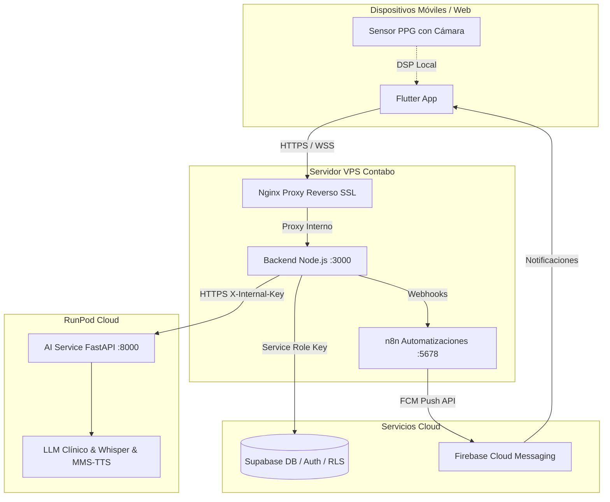

# Biomark AI

Plataforma de salud preventiva y comunitaria que combina una aplicación móvil y web en **Flutter**, una API Gateway en **Node.js/Express**, un motor de inferencia de IA en **Python/FastAPI**, **Supabase** como capa de base de datos y autenticación, y automatización con **n8n**.

El sistema apoya a los pacientes con **fotopletismografía óptica (PPG)** para la estimación de la frecuencia cardíaca, recomendaciones personalizadas basadas en normativas del **MINSA**, seguimiento de evolución clínica de síntomas, asistente virtual de salud multimodal y mapeo de centros de salud.

---

## 1. Arquitectura del Sistema



---

## 2. Funcionalidades Principales

- 💓 **Fotopletismografía Óptica (PPG):** Chequeo de pulso cardíaco (BPM) en 20 segundos utilizando la cámara y linterna del smartphone, con gráfica de onda en tiempo real, eliminación de deriva y clasificación clínica (Normal, Bradicardia, Taquicardia).
- 📋 **Pantalla de Inicio Inteligente:** Tarjeta de signos vitales, panel de acciones rápidas, métricas comunitarias y módulo de recomendaciones de salud adaptadas al contexto nicaragüense (Dengue Normativa 004, Hidratación en olas de calor >30°C, Salud cardiovascular y Cumplimiento de tratamientos).
- 💬 **Asistente Virtual Clínico:** Chat multimodal (texto, imágenes de piel/faringe y mensajes de voz reproducibles estilo WhatsApp). La IA está blindada contra la prescripción de fármacos y emisión de diagnósticos finales, ofreciendo orientación y respuestas educativas (ej. *¿Qué es el sarampión?*).
- 📈 **Seguimiento de Evolución de Síntomas:** Registro estructurado con estados `MEJORO`, `IGUAL`, `EMPEORO` y `NO_SEGURO`, reflejado en la pantalla de *Mi Mejoría*.
- 🏥 **Geolocalización y Centros MINSA:** Mapeo de unidades de salud, cálculo de rutas, especialidades médicas y señales epidemiológicas comunitarias.
- 🔔 **Recordatorios y Notificaciones:** Programación de dosis de medicamentos y jornadas de vacunación sincronizadas con Supabase y n8n.

---

## 3. Estructura del Repositorio

```text
.
├── ai-service/              # Motor de inferencia en Python (FastAPI, PyTorch, Transformers)
├── backend/                 # API Gateway en Node.js/Express (Lógica clínica y proxies)
├── database/                # Migraciones y esquemas de base de datos para Supabase
├── deploy/                  # Archivos de entorno y configuraciones para Docker y VPS
├── docs/                    # Especificaciones OpenAPI, documentación técnica y guías
├── frontend/flutter/        # Aplicación cliente Flutter (arquitectura Feature-First)
├── nginx/                   # Configuración del proxy inverso Nginx con SSL
├── n8n/                     # Flujos de trabajo automatizados para notificaciones
├── docker-compose.yml       # Orquestación monolítica para desarrollo local
└── docker-compose.contabo.yml # Orquestación para despliegue en Contabo VPS
```

---

## 4. Guía de Despliegue

### Despliegue Distribuido (Producción Recomendada)
- **Contabo VPS:** Ejecuta `docker-compose.contabo.yml` con el backend de Node.js, proxy Nginx y n8n.
- **RunPod (GPU):** Ejecuta el contenedor de `ai-service` en una instancia con GPU NVIDIA, exponiendo el puerto 8000 mediante su URL pública segura.
- **Variables de Entorno:**
  - `AI_SERVICE_URL=https://<POD_ID>-8000.proxy.runpod.net` configurado en `deploy/backend.env`.
  - `SUPABASE_URL` y `SUPABASE_SERVICE_ROLE_KEY` en `deploy/backend.env` y `deploy/ai-service.env`.

### Desarrollo Local Monolítico
```bash
# Copiar variables de entorno base
cp deploy/backend.env.example deploy/backend.env
cp deploy/ai-service.env.example deploy/ai-service.env
cp deploy/.env.example deploy/.env

# Levantar todos los servicios en Docker
docker compose --env-file deploy/.env up -d --build
```

---

## 5. Pruebas y Verificación

- **Frontend (Flutter):**
  ```bash
  cd frontend/flutter
  flutter test
  flutter analyze
  ```
- **Backend (Node.js):**
  ```bash
  cd backend
  npm test
  ```
- **AI Service (Python):**
  ```bash
  cd ai-service
  TESTING=1 python3 test_safety_and_evolution.py
  ```
