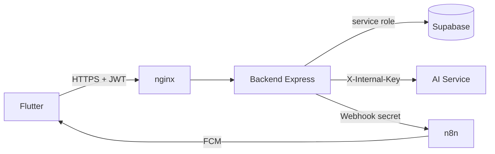

# Biomark AI

Biomark AI es una plataforma de salud preventiva que combina un frontend móvil con Flutter, un backend en Node.js/Express, un servicio de IA en Python/FastAPI, Supabase como capa de datos y autenticación, y automatizaciones con n8n. La intención del sistema es apoyar a pacientes con seguimiento de síntomas, recordatorios, información epidemiológica y asistencia contextual, sin sustituir la valoración médica profesional.

## Estado del repositorio

- Frontend: Flutter disponible en [frontend/flutter](frontend/flutter)
- Backend: API principal en [backend](backend)
- AI Service: servicio interno de IA en [ai-service](ai-service)
- Base de datos y migraciones: [database](database)
- Infraestructura y despliegue: [docker-compose.yml](docker-compose.yml), [nginx](nginx), [deploy](deploy)
- Documentación técnica: [docs](docs)

El proyecto se estructura como un conjunto de servicios conectados en red privada Docker, con nginx como entrada HTTP y Supabase como fuente de verdad de la aplicación. El AI Service no se expone al usuario final; solo se consume desde el backend y desde automatizaciones internas.

## Arquitectura general



## Funcionalidades principales

- Chat multimodal con texto, voz e imágenes. Las respuestas de texto e imagen son texto; una entrada de voz recibe también una respuesta de audio WAV reproducible en Flutter.
- Historial de chat persistido por usuario en `sesiones_chat` y `mensajes_chat`.
- Encuesta clínica con edad, sexo, enfermedades crónicas, antecedentes familiares, alergias, medicamentos y consentimiento explícito.
- Capa de seguridad clínica determinista, clasificación de riesgo, respuestas no diagnósticas y generación controlada para reducir alucinaciones.
- RAG sobre documentos institucionales y contenido contextual.
- Seguimiento de evolución con estados `MEJORO`, `IGUAL`, `EMPEORO` y `NO_SEGURO`.
- Mapa GIS con centros de salud, eventos comunitarios y zonas de riesgo.
- Recomendación de centros de salud por síntomas/especialidad y cercanía. La app solicita ubicación; si no está disponible, la respuesta devuelve `ubicacion_requerida` y explica cómo activar el permiso.
- Medicamentos, vacunas, notificaciones y recordatorios.
- Objetivos de mejoría con hitos actualizables y confirmación inmediata en la interfaz.
- Inicio personalizado con nombre del perfil, objetivo activo y recordatorios pendientes de hoy y mañana.
- Integración con Supabase Auth, almacenamiento y base de datos relacional.
- Automatización de recordatorios vía n8n y FCM.

> La entrega completa de notificaciones push y alertas epidemiológicas requiere configuración operativa real de FCM, Supabase y workflows de n8n.

## Estructura del repositorio

```text
.
├── ai-service/              # IA y servicios internos
├── backend/                 # API Node.js/Express
├── database/                # Schema y migraciones SQL
├── deploy/                  # Plantillas de entorno para producción
├── docs/                    # Documentación técnica, OpenAPI y guías
├── frontend/flutter/        # App móvil Flutter
├── nginx/                   # Configuración de proxy
├── n8n/                     # Workflows exportados
├── docker-compose.yml       # Orquestación local/servidor
├── Dockerfile.ai-service    # Imagen AI Service
├── Dockerfile.backend       # Imagen backend
├── docker-compose.contabo.yml # Backend, nginx y n8n en Contabo
├── README.md                # Vista general del proyecto
└── .gitignore
```

## Inicio rápido

### 1. Requisitos

- Docker + Docker Compose v2
- Node.js 22 para backend y utilidades de desarrollo
- Flutter SDK para la app móvil
- Cuenta Supabase con schema y RLS configurados
- Secrets para backend, AI Service y n8n

### 2. Variables de entorno

Copia las plantillas de ejemplo:

```bash
cp deploy/backend.env.example deploy/backend.env
cp deploy/ai-service.env.example deploy/ai-service.env
cp deploy/.env.example deploy/.env
```

Ajusta los valores reales antes de levantar el proyecto. No publiques `SUPABASE_SERVICE_ROLE_KEY`, `AI_SERVICE_INTERNAL_KEY` ni `N8N_WEBHOOK_SECRET`.

Antes de probar el recomendador clínico, aplica `database/migrations/005_centros_salud_recomendador.sql` en Supabase y carga una vez `database/seeds/seed_centros_salud_managua.sql`.

### 3. Levantar servicios

```bash
docker compose --env-file deploy/.env up -d --build
```

En la arquitectura distribuida, RunPod ejecuta únicamente `ai-service` y Contabo ejecuta `backend`, `nginx` y `n8n`. En Contabo usa `docker-compose.contabo.yml` y configura `AI_SERVICE_URL` con la URL HTTPS del puerto 8000 de RunPod. El Compose principal se conserva para desarrollo en un solo servidor.

Comprueba estado:

```bash
docker compose --env-file deploy/.env ps
curl http://localhost/health
curl http://localhost/ready
```

### 4. Ejecutar frontend localmente

```bash
cd frontend/flutter
flutter pub get
flutter run
```

Para ejecutar en Chrome:

```bash
flutter config --enable-web
flutter run -d chrome
```

La ubicación, cámara y micrófono en web requieren HTTPS y permisos del navegador. La URL base se configura con `BIOMARK_API_URL`; por defecto es `https://biomark-api.duckdns.org`.

## Documentación disponible

- [docs/TECHNICAL_DOCUMENTATION.md](docs/TECHNICAL_DOCUMENTATION.md): arquitectura, módulos, seguridad, base de datos y operación.
- [docs/INSTALLATION_VPS.md](docs/INSTALLATION_VPS.md): instalación y despliegue en VPS.
- [docs/openapi.yaml](docs/openapi.yaml): especificación OpenAPI.
- [docs/postman/Biomark-AI.postman_collection.json](docs/postman/Biomark-AI.postman_collection.json): colección para pruebas de API.
- [backend/README.md](backend/README.md): notas operativas del backend.
- [ai-service/README.md](ai-service/README.md): contrato interno y arquitectura del motor de IA.
- [frontend/flutter/README.md](frontend/flutter/README.md): flujos móviles/web y permisos del dispositivo.

## Buenas prácticas

- No exponer puertos internos 3000, 8000 o 5678 al exterior.
- Mantener HTTPS y JWT en la capa pública.
- Usar RLS en Supabase y mantener el service role solo en servicios backend/AI.
- Proteger los webhooks con `X-Webhook-Secret` y validar origen.
- Registrar auditoría y no divulgar contenido clínico en logs.

## Próximo nivel

El proyecto ya define la base de infraestructura, módulos de negocio y flujo de IA. El siguiente paso es consolidar despliegue real en VPS, validación de Supabase staging, pruebas end-to-end del chat y automatizaciones FCM/n8n con entorno de producción.
