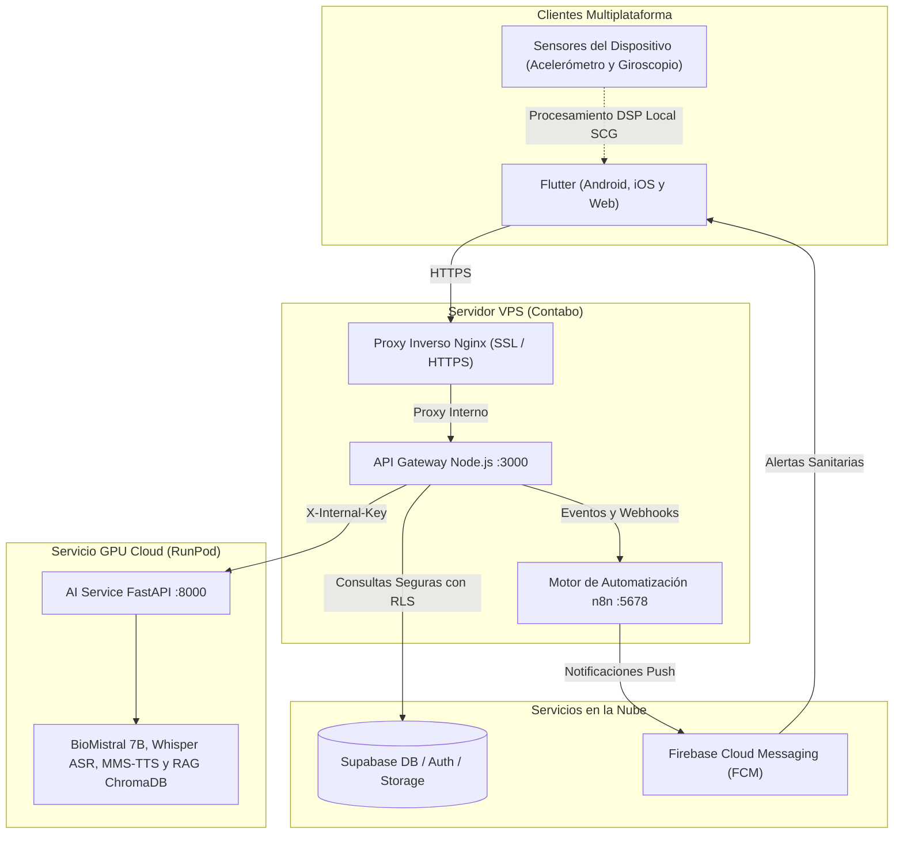

# Biomark AI

Plataforma integral de salud preventiva, comunitaria y telemedicina diseñada para la población nicaragüense, alineada con los protocolos y normativas técnicas del Ministerio de Salud (MINSA).

Biomark AI combina una aplicación cliente multiplataforma (móvil y web) desarrollada en **Flutter**, una pasarela de servicios (API Gateway) en **Node.js y Express**, un microservicio especializado de inteligencia artificial clínica en **Python y FastAPI**, persistencia segura con **Supabase** (PostgreSQL, autenticación y almacenamiento) y automatizaciones de salud pública mediante **n8n**.

---

## 1. Arquitectura del Sistema

La arquitectura está concebida de forma distribuida para optimizar el consumo de recursos, garantizar alta disponibilidad y proteger los datos clínicos:



---

## 2. Funcionalidades Principales

### Medición de Signos Vitales por Sismocardiografía (SCG)
* **Sismocardiografía Torácica (SCG):** Estimación biomecánica de la frecuencia cardíaca (BPM) mediante el acelerómetro y giroscopio del teléfono móvil. Mide las micro-vibraciones esternales generadas por la contracción y eyección ventricular cardíaca:
  * Filtrado digital pasabanda (10 a 30 Hz) para aislar las ondas mecánicas valvulares y atenuar ruidos respiratorios.
  * Algoritmo de detección de picos sistólicos adaptativo con ventana refractaria de 250 ms.
  * Soporte para posturas clínicas: acostado boca arriba (supina) o sentado en reposo.
  * Cálculo de índice de calidad de señal (0% a 100%) y descarte automático de perturbaciones o movimientos bruscos.
  * Clasificación clínica inmediata: ritmo normal (60-100 BPM), bradicardia (<60 BPM) o taquicardia (>100 BPM).
  *(Nota: Se retiró el método óptico por cámara/flash PPG en favor de la precisión y comodidad del método biomecánico SCG).*

### Pautas de Salud MINSA y Priorización Inteligente
* **Catálogo normativo oficial:** Tarjetas informativas de prevención validadas con directrices del Ministerio de Salud (MINSA) de Nicaragua:
  * Prevención y signos de alarma de dengue y arbovirosis (Normativas 004 y 073 del MINSA).
  * Hidratación y protección ante olas de calor extremo (temperaturas superiores a 30 °C).
  * Cuidado y monitoreo de la salud cardiovascular.
  * Cumplimiento y adherencia al tratamiento farmacológico prescrito.
  * Manejo preventivo de diabetes y metabolismo (Normativa 078 del MINSA).
  * Protocolo de salud respiratoria e infecciones estacionales (Normativa 028 del MINSA).
* **Motor de priorización contextual:** El sistema clasifica y ordena las recomendaciones automáticamente según:
  1. Alertas epidemiológicas activas en el municipio del usuario (+10 pts).
  2. Enfermedades crónicas declaradas en la encuesta clínica de salud (+8 pts).
  3. Signos vitales alterados registrados en mediciones recientes de pulso (+7 pts).
  4. Presencia de tratamientos farmacológicos continuos (+5 pts).
* **Gestión por roles (RBAC):** Promotores de salud y personal sanitario autorizado (`PROMOTOR`, `TRABAJADOR_SALUD`, `ADMIN`) disponen de un módulo de gestión para publicar y validar nuevas pautas sanitarias de acuerdo a los estándares oficiales.

### Asistente Clínico Multimodal, Seguro y con Soporte Offline
* **Interacción integral:** Consultas mediante texto, mensajes de voz grabados y fotografías para orientación visual en piel o faringe.
* **Seguridad clínica estricta:** La inteligencia artificial está programada para **no prescribir medicamentos** ni emitir diagnósticos definitivos. Ofrece orientación preventiva, detección de señales de alerta y canalización oportuna a centros de salud.
* **Motor de Chat Offline con Guías Oficiales MINSA:** Capacidad de respuesta clínica autónoma directamente en el dispositivo móvil ante pérdida de conectividad (`OfflineChatEngine` y `MinsaOfflineKnowledge`). Incluye evaluador de banderas rojas críticas, scoring semántico y directrices oficiales de diarrea (Guía 153), dengue (004/073), neumonía (028), diabetes (078), vacunación PAI y glosario coloquial nicaragüense.
* **Seguimiento Proactivo de Evolución de Síntomas:** Detección de lenguaje natural en consultas del usuario para identificar si sus molestias han mejorado, empeorado o continúan igual, desplegando acciones interactivas de un toque (`_FollowUpActionCard`) para registrar la evolución en su expediente.
* **Lenguaje accesible y sin tecnicismos:** Respuestas adaptadas para su comprensión inmediata por familias y comunidades rurales, evitando jerga médica compleja.

### Accesibilidad Universal y Sistema de Diseño Glassmorphism
* **Diseño Glassmorphism Adaptativo:** Componente de superficies translúcidas con desenfoque de fondo (`BiomarkGlassSurface`), integrado con soporte para modo claro y modo oscuro.
* **Tema de Alto Contraste (WCAG AAA):** Modo accesible con contraste superior a 7:1 en fondos, bordes sólidos y textos de alto contraste para personas con baja agudeza visual.
* **Compatibilidad con lectores de pantalla:** Integración completa de etiquetas de accesibilidad (`Semantics`) para TalkBack en Android y VoiceOver en iOS.
* **Sugerencia de modo por voz:** Tarjeta de acceso rápido por voz en la pantalla principal con opción de descarte inmediato y control en los ajustes del perfil.
* **Ergonomía táctil:** Áreas de interacción táctil con dimensiones mínimas de 48x48 dp para facilitar la pulsación.
* **Auditoría Antisolapamiento:** Interfaz responsiva con controles de scroll y restricciones de altura para evitar errores de desbordamiento en cualquier pantalla.

### Panorama Comunitario y Geolocalización Sanitaria
* **Mapa GIS de Alta Precisión:** Geolocalización con precisión en metros (`LocationAccuracy.high`), cálculo geodésico de distancias en tiempo real y chips de filtrado rápido por nivel de unidad (Hospitales, Centros de Salud, Puestos Médicos).
* **Alertas y Eventos Comunitarios:** Visualización de jornadas de vacunación, abatización y fumigación en el sector.
* **Historial de Progreso:** Registro de evolución de síntomas (*Mejoró*, *Igual*, *Empeoró*, *No seguro*) con metas e hitos de recuperación.

### Módulo RAG con Persistencia Incremental
* **Persistencia Inteligente en ChromaDB:** Manifiesto de control local (`chroma_db/indexed_files.json`) que almacena fragmentos de normativas MINSA con metadatos de fuente, página y chunk. Evita re-descargas o cálculos redundantes de embeddings al iniciar el servicio.
* **Modelo Especializado BioMistral 7B:** Total compatibilidad con el modelo de producción en Hugging Face (`BiomarkAI/Biomark-AI-Produccion`) adaptado con plantilla de instrucciones clínicas.

### Gestión de Cuenta y Privacidad
* Autenticación segura mediante correo electrónico o inicio de sesión con Google.
* Gestión de perfil de usuario y avatar alojado en Supabase Storage.
* Encuesta clínica inicial de antecedentes personales y factores de riesgo.
* Eliminación definitiva y segura de cuenta con baja de datos en cascada mediante procedimientos almacenados (`eliminar_cuenta_usuario`).

---

## 3. Estructura del Repositorio

```text
Biomark-AI/
├── ai-service/              # Motor de inferencia en Python (FastAPI, PyTorch, Whisper, TTS)
├── backend/                 # API Gateway y servidor de lógica de negocio en Node.js y Express
├── database/                # Migraciones SQL, esquemas, funciones RPC y semillas para Supabase
├── deploy/                  # Plantillas de variables de entorno y configuraciones de despliegue
├── docs/                    # Especificaciones técnicas, contratos OpenAPI y guías operativas
├── frontend/flutter/        # Aplicación cliente multiplataforma (móvil y web) en Flutter
├── nginx/                   # Configuración del proxy inverso con soporte SSL y límites de tráfico
├── n8n/                     # Flujos de automatización para recordatorios y notificaciones push
├── docker-compose.yml       # Orquestación de servicios para entorno de desarrollo local
└── docker-compose.contabo.yml # Orquestación optimizada para servidor en producción (VPS Contabo)
```

---

## 4. Guía de Puesta en Marcha

### Requisitos Previos
* **Docker y Docker Compose** instalados en el entorno de ejecución.
* **Flutter SDK 3.24+** para compilar la aplicación cliente.
* **Node.js 20+** y **Python 3.10+** (para desarrollo local sin contenedores).
* Cuenta y proyecto configurado en **Supabase**.

### Configuración de Variables de Entorno
Copia los archivos de ejemplo en la carpeta `deploy/` y completa los valores correspondientes:

```bash
cp deploy/.env.example deploy/.env
cp deploy/backend.env.example deploy/backend.env
cp deploy/ai-service.env.example deploy/ai-service.env
```

### Ejecución en Entorno Local con Docker
Para iniciar todos los servicios auxiliares (backend, proxy y automatizaciones):

```bash
docker compose --env-file deploy/.env up -d --build
```

### Ejecución de la Aplicación Flutter
Para ejecutar la aplicación en un emulador, dispositivo físico o navegador web:

```bash
cd frontend/flutter
flutter pub get

# Ejecución en modo depuración (móvil o web)
flutter run -d chrome --dart-define=BIOMARK_API_URL=http://localhost:3000
```

---

## 5. Verificación y Pruebas del Sistema

El proyecto cuenta con suites de pruebas automatizadas en cada uno de sus niveles:

* **Pruebas del cliente Flutter:**
  ```bash
  cd frontend/flutter
  flutter test
  flutter analyze
  ```

* **Pruebas del backend (Node.js):**
  ```bash
  cd backend
  npm test
  ```

* **Pruebas del servicio de IA (Python):**
  ```bash
  cd ai-service
  TESTING=1 python3 -m unittest discover -s . -p "test_*.py"
  ```

---

## 6. Licencia y Cumplimiento Sanitario

Este proyecto ha sido desarrollado como una herramienta tecnológica de apoyo preventivo y educación comunitaria. No sustituye la consulta médica presencial ni los criterios clínicos emitidos por profesionales de la salud colegiados.
