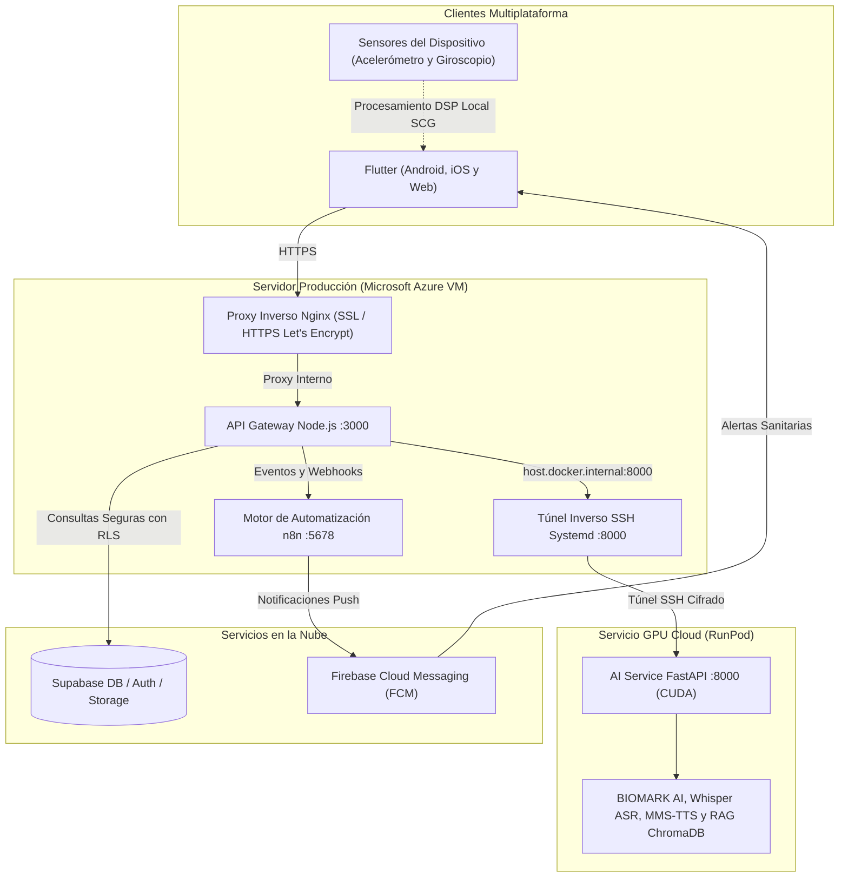

# Biomark AI

Plataforma integral de salud preventiva, comunitaria y telemedicina diseñada para la población nicaragüense, alineada con los protocolos y normativas técnicas del Ministerio de Salud (MINSA).

Biomark AI combina una aplicación cliente multiplataforma (móvil y web) desarrollada en **Flutter**, una pasarela de servicios (API Gateway) en **Node.js y Express**, un microservicio especializado de inteligencia artificial clínica en **Python y FastAPI**, persistencia segura con **Supabase** (PostgreSQL, autenticación y almacenamiento) y automatizaciones de salud pública mediante **n8n**.

---

## 1. Arquitectura del Sistema

La arquitectura está concebida de forma distribuida para optimizar el consumo de recursos, garantizar alta disponibilidad y proteger los datos clínicos:


```mermaid
flowchart TD
  subgraph Clientes ["Clientes Multiplataforma"]
    F["Flutter (Android, iOS y Web)"]
    Sensors["Sensores del Dispositivo (Acelerómetro y Giroscopio)"]
  end

  subgraph ServidorAzure ["Servidor Producción (Microsoft Azure VM)"]
    Nginx["Proxy Inverso Nginx (SSL / HTTPS Let's Encrypt)"]
    Backend["API Gateway Node.js :3000"]
    N8N["Motor de Automatización n8n :5678"]
    Tunnel["Túnel Inverso SSH Systemd :8000"]
  end

  subgraph InferenciaIA ["Servicio GPU Cloud (RunPod)"]
    FastAPI["AI Service FastAPI :8000 (CUDA)"]
    Models["BIOMARK AI, Whisper ASR, MMS-TTS y RAG ChromaDB"]
  end

  subgraph ServiciosCloud ["Servicios en la Nube"]
    DB[("Supabase DB / Auth / Storage")]
    FCM["Firebase Cloud Messaging (FCM)"]
  end

  F -->|HTTPS| Nginx
  Sensors -.->|Procesamiento DSP Local SCG| F
  Nginx -->|Proxy Interno| Backend
  Backend -->|Consultas Seguras con RLS| DB
  Backend -->|host.docker.internal:8000| Tunnel
  Tunnel -->|Túnel SSH Cifrado| FastAPI
  FastAPI --> Models
  Backend -->|Eventos y Webhooks| N8N
  N8N -->|Notificaciones Push| FCM
  FCM -->|Alertas Sanitarias| F
```

---

## 2. Funcionalidades Principales

### Medición de Signos Vitales por Sismocardiografía (SCG)
* **Sismocardiografía Torácica (SCG):** Estimación biomecánica de la frecuencia cardíaca (BPM) mediante el acelerómetro y giroscopio del teléfono móvil. Mide las micro-vibraciones esternales generadas por la contracción y eyección ventricular cardíaca:
  * Filtrado digital pasabanda (10 a 30 Hz) para aislar las ondas mecánicas valvulares y atenuar ruidos respiratorios.
  * Algoritmo de detección de picos sistólicos adaptativo con ventana refractaria de 250 ms.
  * Soporte para posturas clínicas: acostado boca arriba (supina) o sentado en reposo.
  * Cálculo de índice de calidad de señal (0% a 100%) y descarte automático de perturbaciones o movimientos bruscos.
  * Clasificación clínica inmediata: ritmo normal (60-100 BPM), bradicardia (<60 BPM) o taquicardia (>100 BPM).
  *(Nota: Se retiró el método óptico por cámara/flash PPG en favor de la precisión y comodidad del método biomecánico SCG).*

### Pautas de Salud MINSA y Priorización Inteligente
* **Catálogo normativo oficial:** Tarjetas informativas de prevención validadas con directrices del Ministerio de Salud (MINSA) de Nicaragua:
  * Prevención y signos de alarma de dengue y arbovirosis (Normativas 004 y 073 del MINSA).
  * Hidratación y protección ante olas de calor extremo (temperaturas superiores a 30 °C).
  * Cuidado y monitoreo de la salud cardiovascular.
  * Cumplimiento y adherencia al tratamiento farmacológico prescrito.
  * Manejo preventivo de diabetes y metabolismo (Normativa 078 del MINSA).
  * Protocolo de salud respiratoria e infecciones estacionales (Normativa 028 del MINSA).
* **Motor de priorización contextual:** El sistema clasifica y ordena las recomendaciones automáticamente según:
  1. Alertas epidemiológicas activas en el municipio del usuario (+10 pts).
  2. Enfermedades crónicas declaradas en la encuesta clínica de salud (+8 pts).
  3. Signos vitales alterados registrados en mediciones recientes de pulso (+7 pts).
  4. Presencia de tratamientos farmacológicos continuos (+5 pts).
* **Gestión por roles (RBAC):** Promotores de salud y personal sanitario autorizado (`PROMOTOR`, `TRABAJADOR_SALUD`, `ADMIN`) disponen de un módulo de gestión para publicar y validar nuevas pautas sanitarias de acuerdo a los estándares oficiales.

### Asistente Clínico Multimodal, Seguro y con Soporte Offline
* **Interacción integral:** Consultas mediante texto, mensajes de voz grabados y fotografías para orientación visual en piel o faringe.
* **Seguridad clínica estricta:** La inteligencia artificial está programada para **no prescribir medicamentos** ni emitir diagnósticos definitivos. Ofrece orientación preventiva, detección de señales de alerta y canalización oportuna a centros de salud.
* **Motor de Chat Offline con Guías Oficiales MINSA:** Capacidad de respuesta clínica autónoma directamente en el dispositivo móvil ante pérdida de conectividad (`OfflineChatEngine` y `MinsaOfflineKnowledge`). Incluye evaluador de banderas rojas críticas, scoring semántico y directrices oficiales de diarrea (Guía 153), dengue (004/073), neumonía (028), diabetes (078), vacunación PAI y glosario coloquial nicaragüense.
* **Seguimiento Proactivo de Evolución de Síntomas:** Detección de lenguaje natural en consultas del usuario para identificar si sus molestias han mejorado, empeorado o continúan igual, desplegando acciones interactivas de un toque (`_FollowUpActionCard`) para registrar la evolución en su expediente.
* **Lenguaje accesible y sin tecnicismos:** Respuestas adaptadas para su comprensión inmediata por familias y comunidades rurales, evitando jerga médica compleja.

### Accesibilidad Universal y Sistema de Diseño Glassmorphism
* **Diseño Glassmorphism Adaptativo:** Componente de superficies translúcidas con desenfoque de fondo (`BiomarkGlassSurface`), integrado con soporte para modo claro y modo oscuro.
* **Tema de Alto Contraste (WCAG AAA):** Modo accesible con contraste superior a 7:1 en fondos, bordes sólidos y textos de alto contraste para personas con baja agudeza visual.
* **Compatibilidad con lectores de pantalla:** Integración completa de etiquetas de accesibilidad (`Semantics`) para TalkBack en Android y VoiceOver en iOS.
* **Sugerencia de modo por voz:** Tarjeta de acceso rápido por voz en la pantalla principal con opción de descarte inmediato y control en los ajustes del perfil.
* **Ergonomía táctil:** Áreas de interacción táctil con dimensiones mínimas de 48x48 dp para facilitar la pulsación.
* **Auditoría Antisolapamiento:** Interfaz responsiva con controles de scroll y restricciones de altura para evitar errores de desbordamiento en cualquier pantalla.

### Sistema de Roles y Confianza en Cascada (¿Quién ve y hace qué?)

Para proteger los datos clínicos de la población y evitar que cualquier persona se autoasigne privilegios dentro del sistema, Biomark AI implementa un modelo de **gobernanza en cascada** articulado con el MINSA:

| Rol | ¿Quién es? | ¿Cómo se activa? | Pantalla de Inicio (Home) | Menú Inferior (Navbar) | Permisos y Capacidades |
|---|---|---|---|---|---|
| 👤 **`USUARIO`**<br/>*(Ciudadano / Paciente)* | Cualquier persona o paciente en Managua. | **Registro libre** con Correo o botón de Google. | **Pantalla de Salud:** Medición de pulso SCG, encuestas clínicas y evolución de salud. | `[Inicio, Evolución, Mapa, Recordatorio, Perfil]` | Registra signos vitales y síntomas. Emite reportes comunitarios de su barrio (ej. dengue, diarrea, criaderos) asignados automáticamente a su centro más cercano. |
| 🤝 **`PROMOTOR`**<br/>*(Líder Comunitario)* | Brigadista barrial o voluntario de la Red Comunitaria de Salud. | **Código de invitación (`BM-XXXXXX`)** emitido por el Trabajador de Salud de su centro. | **Panel Comunitario:** Señales de alerta territorial y reportes de su zona. | `[Panel, Mapa, Jornadas, Reportes, Perfil]` | Supervisa señales epidemiológicas de su jurisdicción, orienta a vecinos y organiza jornadas comunitarias de vacunación y fumigación. |
| 🩺 **`TRABAJADOR_SALUD`**<br/>*(Personal Médico MINSA)* | Médico, enfermero o epidemiólogo de un Centro de Salud (ej. Sócrates Flores, Edgar Lang). | **Código oficial** emitido por el Administrador SILAIS con Centro de Salud asignado. | **Panel Operativo Territorial:** Filtrado estricto por jurisdicción (`requireScope`). | `[Panel, Mapa, Jornadas, Reportes, Perfil]` | Triaje clínico CCM de reportes, validación o descarte oficial, atención prioritaria de alertas rojas urgentes y emisión de invitaciones para sus promotores. |
| 🏛️ **`ADMIN`**<br/>*(SILAIS Managua / Central)* | Dirección General Departamental SILAIS Managua. | **Credenciales maestras** institucionales preconfiguradas. | **Centro de Comando Departamental (`AdminDashboardScreen`)**. | `[Panel Admin, Mapa Global, Jornadas, Reportes, Perfil]` | Visión macro de todo el departamento, mesa de triaje crítico CCM ROJO, acreditación de directores/médicos por centro de salud y emisión de avisos oficiales MINSA. |

#### Principios Clave del Sistema:
* **Sin Autoasignación:** Nadie puede registrarse directamente como Promotor o Trabajador de Salud desde el formulario general; el registro público solo crea cuentas de `USUARIO`.
* **Tokens Seguros de Un Solo Uso:** Las invitaciones (`BM-XXXXXX`) tienen vigencia de 7 días, un solo uso y heredan de forma inmutable el centro de salud de quien las emitió.
* **Aislamiento Territorial Estricto (`requireScope`):** El personal de salud y promotores de un centro (ej. Edgar Lang en San Judas) únicamente ven reportes de su sector; no pueden ver ni modificar reportes de otros centros (ej. Sócrates Flores).
* **Unificación de Cuentas (Google OAuth vs. Email):** Se normalizan los correos con `toLowerCase().trim()`. Si un profesional o ciudadano se registra con contraseña y luego accede con Google, el sistema vincula automáticamente su `auth_id`, **preservando su rol privilegiado** y evitando duplicados.

### Panorama Comunitario, Triaje CCM y Vigilancia Epidemiológica (Piloto Managua)
* **Scoping Territorial Forzado:** Restricción estricta mediante middleware (`requireScope`) que limita la consulta y gestión de reportes comunitarios y eventos a la jurisdicción territorial de cada promotor y centro médico.
* **Motor de Triaje Comunitario CCM (Normativa 112 MINSA):**
  * Detección automatizada de banderas rojas clínicas: convulsiones, letargo, vómito persistente, signos de choque y tiraje grave.
  * Clasificación determinista en `ROJO` (urgente / requiere traslado), `AMARILLO` (alerta) y `VERDE` (rutinario).
  * Disparo automático de eventos críticos `reporte_comunitario.urgente_rojo` hacia n8n para alertar de inmediato al equipo médico territorial.
  * *(Consulte la documentación técnica completa en [docs/ROLES_CONFANZA_Y_TRIAJE_CCM.md](docs/ROLES_CONFANZA_Y_TRIAJE_CCM.md))*.
* **Recepción Clarificada:** Los reportes de la comunidad indican expresamente que son recibidos y atendidos por el *Personal de Salud del MINSA / Autoridades Correspondientes del Centro de Salud local*.
* **Mapa GIS de Alta Precisión:** Geolocalización con precisión en metros (`LocationAccuracy.high`), cálculo geodésico de distancias en tiempo real y chips de filtrado rápido por nivel de unidad (Hospitales, Centros de Salud, Puestos Médicos).
* **Alertas y Eventos Comunitarios:** Visualización de jornadas de vacunación, abatización y fumigación en el sector con datos reales (Zero-Seed).
* **Historial de Progreso:** Registro de evolución de síntomas (*Mejoró*, *Igual*, *Empeoró*, *No seguro*) con metas e hitos de recuperación.

### Módulo RAG con Persistencia Incremental
* **Persistencia Inteligente en ChromaDB:** Manifiesto de control local (`chroma_db/indexed_files.json`) que almacena fragmentos de normativas MINSA con metadatos de fuente, página y chunk. Evita re-descargas o cálculos redundantes de embeddings al iniciar el servicio.
* **Modelo Especializado BioMistral 7B:** Total compatibilidad con el modelo de producción en Hugging Face (`BiomarkAI/Biomark-AI-Produccion`) adaptado con plantilla de instrucciones clínicas.

### Gestión de Cuenta, Edad Dinámica y Privacidad
* Autenticación segura mediante correo electrónico o inicio de sesión con Google.
* Activación institucional opcional mediante código para personal médico y promotores de salud.
* **Cálculo Dinámico de Edad:** Registro de fecha de nacimiento (`fecha_nacimiento`) con cálculo automático de edad cronológica exacta, evitando actualizaciones manuales anuales.
* Gestión de perfil de usuario y avatar alojado en Supabase Storage.
* Encuesta clínica inicial de antecedentes personales y factores de riesgo.
* Eliminación definitiva y segura de cuenta con baja de datos en cascada mediante procedimientos almacenados (`eliminar_cuenta_usuario`).

---

## 3. Estructura del Repositorio

```text
Biomark-AI/
├── ai-service/              # Motor de inferencia en Python (FastAPI, PyTorch, Whisper, TTS)
├── backend/                 # API Gateway y servidor de lógica de negocio en Node.js y Express
├── database/                # Migraciones SQL, esquemas, funciones RPC y semillas para Supabase
├── deploy/                  # Plantillas de variables de entorno y configuraciones de despliegue
├── docs/                    # Especificaciones técnicas, contratos OpenAPI y guías operativas
├── frontend/flutter/        # Aplicación cliente multiplataforma (móvil y web) en Flutter
├── nginx/                   # Configuración del proxy inverso con soporte SSL y límites de tráfico
├── n8n/                     # Flujos de automatización para recordatorios y notificaciones push
├── docker-compose.yml       # Orquestación de servicios para desarrollo local
├── docker-compose.azure.yml # Orquestación para producción en Microsoft Azure VM
└── docker-compose.contabo.yml # Orquestación alternativa para VPS Contabo
```

---

## 4. Guía de Puesta en Marcha

### Requisitos Previos
* **Docker y Docker Compose** instalados en el entorno de ejecución.
* **Flutter SDK 3.24+** para compilar la aplicación cliente.
* **Node.js 20+** y **Python 3.10+** (para desarrollo local sin contenedores).
* Cuenta y proyecto configurado en **Supabase**.

### Configuración de Variables de Entorno
Copia los archivos de ejemplo en la carpeta `deploy/` y completa los valores correspondientes:

```bash
cp deploy/.env.example deploy/.env
cp deploy/backend.env.example deploy/backend.env
cp deploy/ai-service.env.example deploy/ai-service.env
```

### Ejecución en Entorno Local con Docker
Para iniciar todos los servicios auxiliares (backend, proxy y automatizaciones):

```bash
docker compose --env-file deploy/.env up -d --build
```

### Ejecución de la Aplicación Flutter
Para ejecutar la aplicación en un emulador, dispositivo físico o navegador web:

```bash
cd frontend/flutter
flutter pub get

# Ejecución en modo depuración (móvil o web)
flutter run -d chrome --dart-define=BIOMARK_API_URL=http://localhost:3000
```

---

## 5. Despliegue en Microsoft Azure VM (Producción)

El entorno de producción oficial está alojado en una máquina virtual de **Microsoft Azure** con conectividad cifrada hacia el clúster GPU en **RunPod** y la nube de **Supabase**.

### 5.1 Especificaciones de Infraestructura
* **Proveedor:** Microsoft Azure VM (`Standard_D2as_v4` — 2 vCPUs AMD EPYC, 8 GB RAM, 30 GB SSD).
* **IP Pública:** `20.98.43.91`
* **Dominios Oficiales:**
  * Web y API Gateway: `https://biomark-api.duckdns.org`
  * Motor de Notificaciones: `https://biomark-n8n.duckdns.org`
* **Certificados SSL:** Let's Encrypt con auto-renovación, soporte SAN para ambos dominios y redirección obligatoria HTTP 301 a HTTPS.

### 5.2 Topología y Seguridad de Red (Defensa en Profundidad)
* **Firewall de Host (UFW):**
  * Puertos públicos permitidos: `22/tcp` (SSH), `80/tcp` (HTTP) y `443/tcp` (HTTPS).
  * Puertos internos bloqueados a internet: `3000/tcp` (Express) y `5678/tcp` (n8n).
  * Subred Docker interna (`172.16.0.0/12`) autorizada para comunicarse con el túnel del AI Service en el puerto 8000.
* **Seguridad Nginx:**
  * Ocultamiento de cabeceras de versión (`server_tokens off;`).
  * Pantallas de error amigables (`404.html` y `50x.html`) sin exposición de stacktraces ni códigos técnicos.
  * Rate limiting de 10 peticiones/segundo con ráfaga de 20 por IP.

### 5.3 Túnel Seguro con la GPU de RunPod (AI Service)
El microservicio clínico de IA con aceleración CUDA reside en RunPod y se conecta con Azure mediante un servicio administrado de systemd (`runpod-tunnel.service`):
```bash
# Ver estado del túnel seguro de IA en Azure:
sudo systemctl status runpod-tunnel.service
```
El contenedor de backend en Docker accede al servicio a través de `http://host.docker.internal:8000` autenticado mediante la cabecera `X-Internal-Key`.

### 5.4 Flujo de Notificaciones y Webhook en n8n
El motor de eventos del backend (`n8nClient.js`) publica eventos sanitarios hacia el webhook interno de n8n (`http://n8n:5678/webhook/eventos-backend`):
* Autenticación obligatoria con cabecera `X-Webhook-Secret`.
* Flujo de trabajo importado y activo: `n8n/workflows/n8n-eventos-backend.json`.
* Gestión mediante CLI dentro del contenedor:
  ```bash
  docker exec -u node biomark-ai-n8n-1 n8n list:workflow
  docker exec -u node biomark-ai-n8n-1 n8n update:workflow --id=WTokXGSmeaqUK6OI --active=true
  ```

### 5.5 Comandos Forenses de Validación (Healthcheck Rápido)
Desde cualquier terminal local o remota:
```bash
# 1. Healthcheck general del sistema
curl -s https://biomark-api.duckdns.org/health

# 2. Diagnóstico de componentes (Supabase DB y AI Service)
curl -s https://biomark-api.duckdns.org/ready

# 3. Acceso seguro al panel de n8n
curl -s -o /dev/null -w "%{http_code}\n" https://biomark-n8n.duckdns.org/

# 4. Redirección HTTP a HTTPS obligatoria
curl -I http://biomark-api.duckdns.org/
```

### 5.6 Sincronización Continua con GitHub
El directorio `/opt/biomark-ai` en Azure está vinculado directamente a la rama `main` del repositorio oficial. Para actualizar el servidor:
```bash
cd /opt/biomark-ai
git fetch origin main
git checkout main
git pull origin main
sudo docker compose -f docker-compose.azure.yml up -d --build
```

---

## 6. Verificación y Pruebas del Sistema

El proyecto cuenta con suites de pruebas automatizadas en cada uno de sus niveles:

* **Pruebas del cliente Flutter (16 pruebas unitarias pasando y 0 advertencias de análisis):**
  ```bash
  cd frontend/flutter
  flutter test
  flutter analyze
  ```

* **Pruebas del backend (Node.js - 22 pruebas unitarias pasando):**
  ```bash
  cd backend
  npm test
  ```

* **Pruebas del servicio de IA (Python):**
  ```bash
  cd ai-service
  TESTING=1 python3 -m unittest discover -s . -p "test_*.py"
  ```

---

## 7. Licencia y Cumplimiento Sanitario

Este proyecto ha sido desarrollado como una herramienta tecnológica de apoyo preventivo y educación comunitaria. No sustituye la consulta médica presencial ni los criterios clínicos emitidos por profesionales de la salud colegiados.

