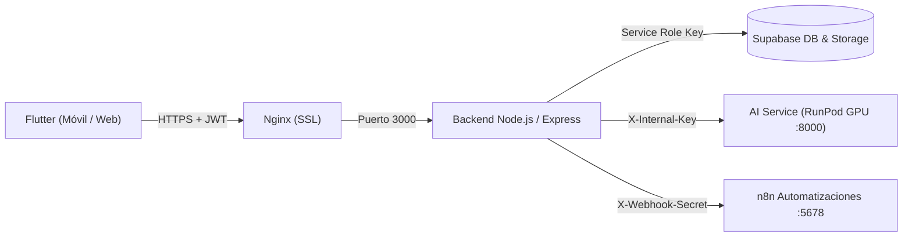

# Biomark AI — Backend (Node.js & Express)

Pasarela de servicios (API Gateway) y servidor de lógica de negocio del ecosistema Biomark AI. Se encarga de la gestión de identidades, persistencia en Supabase, control de acceso basado en roles (RBAC), auditoría operativa de recomendaciones sanitarias del MINSA, geolocalización de unidades de salud y comunicación segura con el microservicio de IA en RunPod.

---

## 1. Arquitectura de Despliegue

El backend se ejecuta en un contenedor Docker en el VPS de Contabo, gestionado mediante `docker-compose.contabo.yml` y protegido por un proxy inverso Nginx con cifrado TLS:



---

## 2. Módulos y Rutas de la API

### Recomendaciones de Salud MINSA y Control de Roles (RBAC)
* `GET /api/recommendations`: Consulta pública para usuarios autenticados del catálogo de recomendaciones oficiales y comunitarias validadas.
* `POST /api/recommendations`: Publicación de nuevas pautas preventivas. Valida obligatoriamente mediante Zod la cita de la normativa MINSA de respaldo, categorías aprobadas y formato visual. Protegido para roles `TRABAJADOR_SALUD`, `PROMOTOR` y `ADMIN`.
* `PUT /api/recommendations/:id`: Actualización de contenidos normativos (protegido por RBAC).
* `DELETE /api/recommendations/:id`: Retiro o eliminación de pautas (protegido por RBAC).
* Registro automático de auditoría en la tabla `auditoria_operativa` ante cada cambio clínico.

### Asistencia Clínica e IA (Proxy Seguro)
* `POST /api/chat`: Procesa mensajes de texto del paciente, consulta sus antecedentes clínicos en Supabase (enfermedades crónicas, alergias y medicamentos), delega la inferencia al AI Service y almacena el diálogo en `sesiones_chat`.
* `POST /api/voice`: Recibe grabaciones de audio (`.m4a` / `.wav`), ejecuta la transcripción con Whisper ASR y devuelve el texto con audio sintetizado (MMS-TTS) para su reproducción en la aplicación.
* `POST /api/vision`: Envía imágenes para evaluación asistida de patologías cutáneas o faríngeas.

### Gestión de Usuarios y Perfil
* `GET /api/users/profile` y `PUT /api/users/profile`: Consulta y actualización de datos personales y preferencias de salud.
* `POST /api/users/avatar`: Subida de fotografía de perfil vinculada al bucket seguro de Supabase Storage.
* `POST /api/users/push-token`: Registro de tokens de Firebase Cloud Messaging (FCM).
* `DELETE /api/users/account`: Proceso de baja definitiva y eliminación segura en cascada del usuario mediante procedimiento almacenado (`dar_de_baja_usuario`).

### Seguimiento de Evolución de Síntomas
* `POST /api/progress`: Registro de la evolución sintomática con estados clínicos normalizados (`MEJORO`, `IGUAL`, `EMPEORO`, `NO_SEGURO`).
* `GET /api/progress`: Cálculo del porcentaje de evolución semanal y resumen histórico.

### Red de Salud y Geolocalización (GIS)
* `GET /api/gis/smart-map`: Obtención de centros de salud, eventos comunitarios y zonas epidemiológicas dentro de un radio geográfico determinado.
* `GET /api/navigation/recommend`: Sugerencia del centro de salud más apropiado según el cuadro clínico del paciente y la especialidad requerida.

### Recordatorios y Notificaciones
* `GET /api/reminders` y `POST /api/reminders`: Creación y seguimiento de tomas de medicamentos y citas.
* `PATCH /internal/reminders/:id/sent`: Endpoint interno protegido por `X-Webhook-Secret` para confirmación de entrega desde n8n.

---

## 3. Variables de Entorno

El archivo de configuración se ubica en `deploy/backend.env`:

```env
PORT=3000
NODE_ENV=production
SUPABASE_URL=https://tu-proyecto.supabase.co
SUPABASE_SERVICE_ROLE_KEY=tu_service_role_key
AI_SERVICE_URL=https://POD_ID-8000.proxy.runpod.net
AI_SERVICE_INTERNAL_KEY=tu_clave_interna_secreta
N8N_WEBHOOK_SECRET=tu_secreto_para_n8n
CORS_ORIGINS=https://tu-dominio.org,http://localhost:3000
```

---

## 4. Instalación y Verificación

```bash
# Instalación de dependencias del proyecto
npm install

# Ejecución de la suite completa de pruebas unitarias
npm test
```
