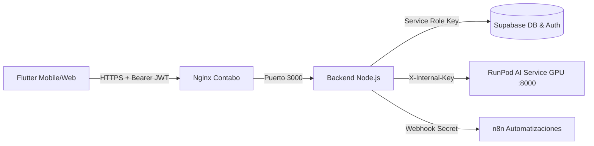

# Biomark AI — Backend (Node.js & Express)

API Gateway y servidor de lógica de negocio para Biomark AI. Se encarga de la gestión de sesiones de usuario, persistencia clínica en Supabase, auditoría de evolución de síntomas, geolocalización de centros de salud y proxy seguro hacia el motor de IA en RunPod.

---

## 1. Arquitectura de Despliegue (Contabo VPS + RunPod)

El backend corre en un contenedor Docker en el VPS de Contabo, gestionado por `docker-compose.contabo.yml` detrás de un proxy inverso Nginx con certificado SSL (HTTPS).



---

## 2. Endpoints Principales

### Asistencia Clínica e IA (Proxy Seguro)
- `POST /api/chat`: Procesa mensajes de texto del usuario, inyecta antecedentes clínicos de la encuesta de salud, llama al AI Service y persiste el historial en `sesiones_chat` y `mensajes_chat`.
- `POST /api/voice`: Recibe un archivo de audio (m4a/wav), lo transcribe mediante Whisper ASR y devuelve la respuesta en texto y audio sintetizado (MMS TTS) reproducible en Flutter.
- `POST /api/vision`: Envía fotografías clínicas para clasificación asistida de patologías de piel o faringe.

### Seguimiento de Evolución de Salud
- `POST /api/progress`: Registra la evolución de síntomas con los estados clínicos estándar:
  - `MEJORO`
  - `IGUAL`
  - `EMPEORO`
  - `NO_SEGURO`
- `GET /api/progress`: Obtiene el historial de evolución y porcentaje semanal del paciente.

### Centros de Salud y GIS
- `GET /api/gis/smart-map`: Retorna centros de salud, eventos y zonas de riesgo dentro del radio geográfico especificado.
- `GET /api/navigation/recommend`: Sugiere el centro de salud óptimo según los síntomas detectados y especialidad médica requerida.

### Salud Preventiva y Recordatorios
- `GET /api/reminders` y `POST /api/reminders`: Gestión de recordatorios para toma de medicamentos y vacunación.
- `POST /api/users/push-token`: Registro de tokens FCM para alertas y avisos preventivos.

---

## 3. Variables de Entorno (`deploy/backend.env`)

```bash
PORT=3000
NODE_ENV=production
SUPABASE_URL=https://tu-proyecto.supabase.co
SUPABASE_SERVICE_ROLE_KEY=tu_service_role_key
AI_SERVICE_URL=https://POD_ID-8000.proxy.runpod.net
AI_SERVICE_INTERNAL_KEY=tu_clave_interna_compartida
N8N_WEBHOOK_SECRET=tu_secret_de_n8n
CORS_ORIGINS=https://biomark-api.duckdns.org,http://localhost:3000
```

---

## 4. Ejecución y Verificación

Instalación de dependencias y pruebas automáticas:

```bash
npm install
npm test
```
