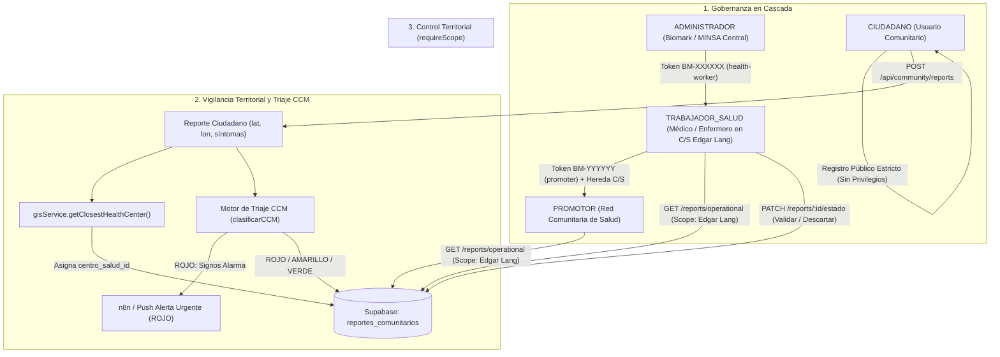
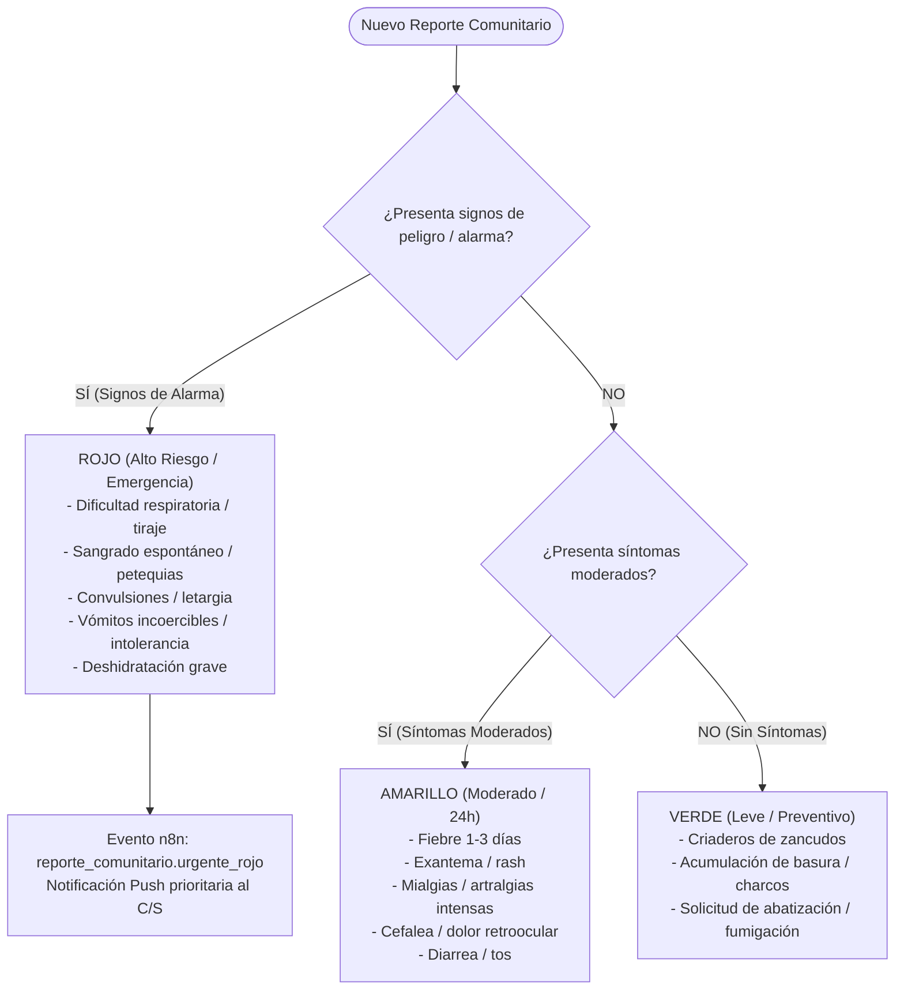

# Roles de Confianza en Cascada, Scoping Territorial y Triaje Comunitario CCM
### Especificación Técnica — Piloto Acotado a Managua — Biomark AI

Este documento detalla la arquitectura, flujos operativos, esquemas de datos y lógica clínica de la extensión de **Gobernanza Sanitaria en Cascada** y **Triaje Semafórico Comunitario (CCM - Manejo de Casos Comunitarios)** de Biomark AI, diseñada para un piloto en el departamento de Managua (Distritos II y III) articulado con personal y promotores de la red del Ministerio de Salud (MINSA).

---

## 1. Resumen Ejecutivo y Problema Resuelto

### El Problema Anterior
1. **Autoasignación no regulada de roles:** En esquemas de registro convencionales, un usuario malintencionado o desinformado podía intentar solicitar o autoasignarse credenciales de "promotor" o "personal de salud".
2. **Cuello de botella administrativo:** Depender de que un único Administrador central apruebe manualmente solicitudes de roles en una cola global (`solicitudes_roles`) no es escalable ni garantiza la verificación presencial comunitaria.
3. **Falta de delimitación territorial:** Los promotores veían reportes de toda la ciudad sin filtro geográfico, diluyendo la capacidad de respuesta de cada establecimiento de salud.
4. **Vigilancia pasiva indiferenciada:** Los reportes comunitarios quedaban en estado pasivo (`PENDIENTE_VALIDACION`) sin categorización de riesgo, de modo que un cuadro con signos de alarma (ej. dengue con sangrado o neumonía grave) recibía el mismo tratamiento que una solicitud de fumigación.

### La Solución Implementada
Biomark AI adopta un modelo de **confianza en cascada (Cascade Trust Governance)** inspirado en la estructura real del MINSA y el protocolo internacional **CCM (Community Case Management)**:
1. **Cadena de confianza delegada:**
   * El `ADMIN` únicamente emite invitaciones seguras a médicos o enfermeros verificados de los centros de salud piloto en Managua (ej. Centro de Salud Edgar Lang en San Judas o Centro de Salud Sócrates Flores).
   * Cada **Trabajador de Salud** verificado es quien invita y supervisa a sus propios **Promotores Comunitarios**, heredando automáticamente su mismo centro de salud.
   * El registro público general **únicamente permite el rol `USUARIO` (Ciudadano)**. No existe autoasignación ni escalación de privilegios sin código de invitación.
2. **Scoping territorial estricto (`requireScope`):**
   * El personal de salud y los promotores solo visualizan y operan sobre los reportes epidemiológicos generados dentro de la jurisdicción de su propio centro de salud.
   * El `ADMIN` retiene visibilidad global y consolidada de todo Managua.
3. **Georreferenciación fail-safe y triaje semafórico:**
   * Los reportes ciudadanos se vinculan automáticamente al centro de salud más cercano mediante cálculo geodésico Haversine en el backend (`gisService.getClosestHealthCenter`).
   * Motor de triaje clínico CCM que clasifica en **ROJO** (prioridad inmediata / signos de alarma), **AMARILLO** (moderado) y **VERDE** (leve / preventivo). Si es **ROJO**, dispara notificación prioritaria inmediata hacia el personal del centro.

### Matriz Comparativa de Roles en Biomark AI

| Rol | ¿Quién es? | ¿Cómo se activa? | Pantalla Principal (Home) | Menú Inferior (Navbar) | Permisos y Capacidades |
|---|---|---|---|---|---|
| 👤 **`USUARIO`**<br/>*(Ciudadano / Paciente)* | Cualquier habitante o paciente en Managua. | **Registro libre** con Correo o botón de Google. | **Pantalla de Salud:** Medición de pulso SCG, encuestas clínicas y evolución. | `[Inicio, Evolución, Mapa, Recordatorio, Perfil]` | Registra signos vitales y síntomas. Emite reportes comunitarios de su barrio asignados automáticamente a su centro más cercano. |
| 🤝 **`PROMOTOR`**<br/>*(Líder Comunitario)* | Brigadista barrial o voluntario de la Red Comunitaria. | **Código de invitación (`BM-XXXXXX`)** emitido por el Trabajador de Salud de su centro. | **Panel Comunitario:** Señales de alerta territorial y reportes de su zona. | `[Panel, Mapa, Jornadas, Reportes, Perfil]` | Supervisa señales epidemiológicas de su jurisdicción, orienta a vecinos y organiza jornadas comunitarias de salud. |
| 🩺 **`TRABAJADOR_SALUD`**<br/>*(Personal Médico MINSA)* | Médico, enfermero o epidemiólogo de un Centro de Salud (ej. Edgar Lang, Sócrates Flores). | **Código oficial** emitido por el Administrador SILAIS con Centro de Salud asignado. | **Panel Operativo Territorial:** Filtrado estricto por jurisdicción (`requireScope`). | `[Panel, Mapa, Jornadas, Reportes, Perfil]` | Triaje clínico CCM de reportes, validación o descarte oficial, atención prioritaria de alertas rojas y emisión de invitaciones para sus promotores. |
| 🏛️ **`ADMIN`**<br/>*(SILAIS Managua / Central)* | Dirección General Departamental SILAIS Managua. | **Credenciales maestras** institucionales preconfiguradas. | **Centro de Comando Departamental (`AdminDashboardScreen`)**. | `[Panel Admin, Mapa Global, Jornadas, Reportes, Perfil]` | Visión macro de todo el departamento, mesa de triaje crítico CCM ROJO, acreditación de personal médico y emisión de avisos oficiales MINSA. |

---

## 2. Diagrama de Arquitectura y Flujo de Confianza



---

## 3. Modelo de Datos (PostgreSQL en Supabase)

La arquitectura se fundamenta en la **Migración 021** (`database/migrations/021_roles_cascada_minsa_ccm.sql`):

### 3.1 Extensión a `public.usuarios`
| Campo | Tipo | Restricción | Propósito |
|---|---|---|---|
| `centro_salud_id` | `uuid` | `FK -> centros_salud(id) ON DELETE SET NULL` | Establecimiento de salud al que está adscrito el funcionario o promotor. |
| `invitado_por` | `uuid` | `FK -> usuarios(id) ON DELETE SET NULL` | Trazabilidad del usuario de nivel superior que emitió la credencial. |
| `estado_cuenta` | `text` | `CHECK (estado_cuenta IN ('ACTIVO', 'SUSPENDIDO'))` | Control de habilitación operativa; permite suspender a un promotor en caso de cese de funciones. |

### 3.2 Extensión a `public.centros_salud`
| Campo | Tipo | Restricción | Propósito |
|---|---|---|---|
| `codigo_establecimiento` | `text` | `UNIQUE` | Código numérico oficial según la Normativa 112 del MINSA para establecimientos prestadores de servicios de salud. |

### 3.3 Tabla de Invitaciones (`public.invitaciones`)
| Campo | Tipo | Restricción | Propósito |
|---|---|---|---|
| `id` | `uuid` | `PRIMARY KEY DEFAULT uuid_generate_v4()` | Identificador único del registro. |
| `token` | `text` | `UNIQUE NOT NULL` | Código alfanumérico seguro en formato `BM-XXXXXX`. |
| `contacto` | `text` | `NOT NULL` | Correo electrónico o número celular del destinatario. |
| `rol_destino` | `text` | `CHECK IN ('TRABAJADOR_SALUD', 'PROMOTOR')` | Rol que adquirirá el usuario tras el canje. |
| `centro_salud_id` | `uuid` | `FK -> centros_salud(id) ON DELETE CASCADE` | Centro de salud asignado forzosamente a la credencial. |
| `creado_por` | `uuid` | `FK -> usuarios(id) ON DELETE CASCADE` | Usuario emisor (Admin o Trabajador de Salud). |
| `expira_en` | `timestamptz` | `NOT NULL` | Fecha límite de canje (por defecto 7 días). |
| `usado_en` | `timestamptz` | Nullable | Marca temporal del momento del canje (un solo uso). |
| `usuario_resultante_id` | `uuid` | `FK -> usuarios(id) ON DELETE SET NULL` | Usuario de dominio creado o actualizado tras canjear el código. |

### 3.4 Extensión a `public.reportes_comunitarios`
| Campo | Tipo | Restricción | Propósito |
|---|---|---|---|
| `centro_salud_id` | `uuid` | `FK -> centros_salud(id) ON DELETE SET NULL` | Establecimiento responsable del sector territorial del reporte. |
| `clasificacion_ccm` | `text` | `CHECK IN ('VERDE', 'AMARILLO', 'ROJO')` | Nivel de severidad asignado por el motor de triaje. |
| `asignado_a` | `uuid` | `FK -> usuarios(id) ON DELETE SET NULL` | Promotor o trabajador asignado para la visita de campo. |

---

## 4. Endpoints del Backend (`/api/invitations` y `/api/community`)

### 4.1 Módulo de Invitaciones Institucionales
* `POST /api/invitations/health-worker`
  * **Acceso:** Solo `ADMIN` (`requireRole('ADMIN')`).
  * **Payload:** `{ "contacto": "medico@minsa.gob.ni", "centro_salud_id": "UUID", "expira_dias": 7 }`
  * **Respuesta:** Objeto de invitación con `token` (ej. `BM-7A8B9C`).
* `POST /api/invitations/promoter`
  * **Acceso:** Solo `TRABAJADOR_SALUD` (`requireRole('TRABAJADOR_SALUD')`).
  * **Payload:** `{ "contacto": "+505 8888 1234", "expira_dias": 7 }`
  * **Lógica:** Hereda automáticamente el `centro_salud_id` del trabajador emisor.
* `GET /api/invitations/my-promoters`
  * **Acceso:** `TRABAJADOR_SALUD` y `ADMIN`.
  * **Respuesta:** Lista de promotores adscritos a su centro de salud con su estado (`ACTIVO`/`SUSPENDIDO`) y lista de invitaciones pendientes.
* `PATCH /api/invitations/promoters/:id/status`
  * **Acceso:** `TRABAJADOR_SALUD` y `ADMIN`.
  * **Payload:** `{ "estado": "SUSPENDIDO" | "ACTIVO" }`
  * **Efecto:** Al suspenderse, el middleware `auth.middleware.js` y `resolverUsuario.js` bloquean de inmediato el acceso operativo del usuario.
* `GET /api/invitations/verify/:token`
  * **Acceso:** Público.
  * **Respuesta:** `{ "valido": true, "token": "BM-...", "rol_destino": "...", "centro_salud": { "nombre": "...", "municipio": "..." } }`.
* `POST /api/invitations/accept`
  * **Acceso:** Público.
  * **Payload:** `{ "token": "BM-...", "email": "...", "password": "...", "full_name": "..." }`
  * **Efecto:** Valida el token, crea o autentica la cuenta, asigna el rol y centro de forma atómica, marca la invitación como usada y registra auditoría.

### 4.2 Middleware de Scoping Territorial (`requireScope.middleware.js`)
Se aplica en las rutas operativas:
* `GET /api/community/reports/operational`
* `PATCH /api/community/reports/:id/estado`

**Reglas de evaluación:**
1. Si `req.usuarioRol === 'ADMIN'`: Permite el paso con `req.scopeCentroSaludId = null` (visión global de Managua).
2. Si `req.usuarioRol` es `TRABAJADOR_SALUD` o `PROMOTOR`:
   * Verifica que `req.centroSaludId` exista. Si la cuenta no tiene centro asignado, rechaza con **HTTP 403 Forbidden**.
   * Fija `req.scopeCentroSaludId = req.centroSaludId`.
   * En las consultas a la base de datos, filtra estrictamente por `.eq('centro_salud_id', scopeCentroSaludId)`. Un promotor de Edgar Lang no puede ver ni modificar reportes de Sócrates Flores.

---

## 5. Motor de Triaje Semafórico CCM (Manejo de Casos Comunitarios)

Implementado en `backend/src/modules/community/community.service.js` mediante la función `clasificarCCM(payload)`:



### Reglas Clínicas de Triaje:
1. **ROJO (Alarma / Prioridad Inmediata):**
   * *Palabras clave y signos detectados:* dificultad respiratoria, disnea, falta de aire, asfixia, sangrado, hemorragia, petequias, epistaxis, gingivorragia, letargia, somnolencia extrema, convulsiones, vómito incoercible, intolerancia oral, dolor abdominal intenso, shock, deshidratación grave.
   * *Acción inmediata:* No queda esperando validación pasiva. Emite el evento `reporte_comunitario.urgente_rojo` hacia n8n/push.
2. **AMARILLO (Moderado):**
   * *Signos detectados:* fiebre, calentura, exantema, rash, manchas rojas, mialgia, dolor articular, cefalea, dolor retroocular, diarrea, tos. Requiere visita de seguimiento comunitario en las siguientes 24 horas.
3. **VERDE (Leve o Preventivo):**
   * Reportes ambientales, criaderos de mosquitos, basura acumulada, solicitudes de abatización o fumigación intradomiciliar.
4. **Principio Fail-Safe:** Si un reporte viene marcado como leve o preventivo pero su texto o signos contienen expresiones de peligro (ej. *"presentó convulsiones"* o *"está sangrando de la nariz"*), el motor escala automáticamente la severidad a **ROJO**.

---

## 6. Experiencia de Usuario en la Aplicación Móvil (Flutter)

1. **Sesión Institucional y Estado (`AuthSession`):**
   * Persiste de forma segura en `FlutterSecureStorage` el `healthCenterId` y `healthCenterName`.
   * Provee los getters: `isHealthWorker`, `isPromoter`, `canManagePromoters` y `isFieldAgent`.
2. **Registro con Código de Invitación Oficial (`RegisterScreen`):**
   * Botón secundario: *"Tengo un código de invitación oficial (Personal MINSA / Promotor)"*.
   * Modal de activación institucional:
     1. El usuario introduce el token recibido (ej. `BM-9F2B81`).
     2. Al verificarlo, visualiza la tarjeta con el Centro de Salud asignado y el rol institucional validado.
     3. Introduce su nombre, correo y contraseña.
     4. La aplicación activa las credenciales e inicia sesión directamente con el rol correspondiente.
3. **Panel Operativo y Red de Promotores (`promoter_screens.dart`):**
   * **Cabecera de Jurisdicción:** Muestra el centro de salud asignado al usuario y su categoría institucional.
   * **Insignias CCM:** Cada reporte incluye un badge semafórico de alta visibilidad (`CCM: ALTO RIESGO (ROJO)`, `CCM: MODERADO (AMARILLO)`, `CCM: LEVE (VERDE)`) junto con el nombre del centro de salud territorial.
   * **Pantalla "Red de Promotores" (`MyPromotersScreen`):**
     * Accesible para Trabajadores de Salud y Administradores.
     * Botón *"Invitar Promotor"*: formulario ágil que genera el código `BM-XXXXXX` con botón de copiado directo al portapapeles.
     * Lista de promotores con chips de estado (`ACTIVO` / `SUSPENDIDO`) y menú contextual para suspender o reactivar accesos.
4. **Navegación Unificada (`app_shell.dart`):**
   * Tanto `PROMOTOR` como `TRABAJADOR_SALUD` disfrutan de la navegación operativa de 5 pestañas: *Panel*, *Mapa*, *Jornadas*, *Reportes* y *Perfil*.

---

## 7. Verificación y Control de Calidad

* **Pruebas de Backend:**
  ```bash
  npm --prefix backend test
  # 22/22 PASSED (incluye suites de Zod, requireScope, CCM triage e invitaciones)
  ```
* **Análisis Estático Flutter:**
  ```bash
  flutter analyze lib/
  # 0 issues encontrados (Clean)
  ```
* **Pruebas de Widgets y Dominio Flutter:**
  ```bash
  flutter test
  # 16/16 PASSED (100% aprobado)
  ```
