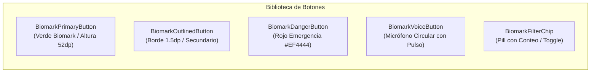
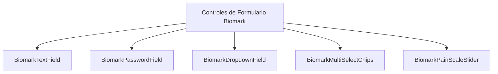

# Sistema de Componentes de UI — Biomark AI
### Biblioteca Oficial de Elementos Reutilizables para Desarrollo
**Versión:** 2.0.0 | **Framework:** Flutter (Mobile Android/iOS, Web & Desktop) | **Normativa:** WCAG 2.1 AA / AAA

---

## 1. Resumen Ejecutivo y Filosofía de Diseño

El **Sistema de Componentes de UI de Biomark AI** proporciona un catálogo modular, accesible y reactivo de componentes visuales para la plataforma de telemedicina comunitaria, monitoreo fisiológico (SCG / PPG) y vigilancia epidemiológica del Ministerio de Salud (MINSA) en Managua.

### Principios Rectores:
1. **Consistencia Sanitaria e Institucional:** Todo elemento visual comunica rigor clínico, confianza y jerarquía de alerta inmediata (protocolo CCM).
2. **Accesibilidad Universal (A11y):** Cumplimiento estricto de WCAG 2.1 nivel AA y AAA (modo de alto contraste con ratio > 7:1, áreas táctiles mínimas de 48×48 dp y etiquetas Semantics para lectores de pantalla).
3. **Resistencia a Fallos de Red y Contexto Real:** Componentes con estados dedicados para conectividad offline, sincronización pendiente y baja alfabetización digital (modo asistido por voz).
4. **Bitemático y Alto Contraste:** Adaptación automática a **Modo Claro**, **Modo Oscuro** y **Modo Alto Contraste**.

---

## 2. Tokens de Diseño (Design Tokens)

### 2.1 Paleta de Color Corporativa y Sanitaria (`BiomarkColors`)

| Token | Valor Hex | Muestra | Nombre Clínico / Rol | Uso Principal |
| :--- | :--- | :---: | :--- | :--- |
| `primary` | `#46AB39` | 🟢 | **Verde Biomark (Salud y Vida)** | Botones principales, estados normales, confirmaciones, salud preventiva. |
| `secondary` | `#3260A9` | 🔵 | **Azul Biomark (Institucional MINSA)** | Barras de navegación, cabeceras, enlaces, acciones secundarias, tarjetas informativas. |
| `backgroundClaro` | `#F9F9FC` | ⚪ | **Fondo Clínico Claro** | Fondo general de scaffolds en tema diurno. |
| `backgroundOscuro`| `#121212` | ⚫ | **Fondo Clínico Oscuro** | Fondo general en modo nocturno para reducir fatiga ocular. |
| `superficieOscura`| `#1E1E1E` / `#1E293B` | 🔘 | **Superficie Slate Oscura** | Fondo de tarjetas, hojas modales y paneles en modo nocturno. |
| `white` | `#FFFFFF` | ⚪ | **Blanco Puro** | Superficies de tarjetas en modo claro, textos sobre fondos de color. |
| `black` | `#000000` | ⚫ | **Negro Puro** | Textos en alto contraste, bordes estructurales AAA. |
| `dividerClaro` | `#EFEFF3` | 🔘 | **Divisor Sutil** | Separadores y bordes en modo diurno. |
| `dividerOscuro` | `#2E2E33` | 🔘 | **Divisor Nocturno** | Separadores en modo nocturno. |

### 2.2 Semáforo de Triaje Comunitario CCM (Community Case Management)

| Nivel de Triaje | Color Hex | Color Oscuro | Ratio Contraste | Significado Clínico MINSA | Acción Requerida |
| :--- | :--- | :--- | :---: | :--- | :--- |
| 🔴 **ROJO** (Urgente) | `#EF4444` | `#CF6679` | > 4.5:1 | **Signos de alarma o peligro grave** (sangrado, disnea severa, letargo, choque). | Disparo inmediato de push a médicos del centro y derivación al hospital. |
| 🟡 **AMARILLO** (Alerta)| `#F59E0B` | `#FBBF24` | > 4.5:1 | **Prioridad moderada** (fiebre > 38.5°C por más de 3 días, deshidratación leve). | Consulta y seguimiento ambulatorio en el puesto o centro de salud en 24h. |
| 🟢 **VERDE** (Rutinario) | `#10B981` | `#46AB39` | > 4.5:1 | **Caso leve o preventivo** (consulta de control, solicitud de abatización/fumigación). | Cuidados en el hogar, hidratación oral y medidas de higiene barrial. |
| 🔵 **AZUL** (Informativo)| `#3B82F6` | `#60A5FA` | > 4.5:1 | **Aviso oficial / Jornada comunitaria** (vacunación, control prenatal). | Participación ciudadana o recordatorio agendado. |

### 2.3 Sistema Tipográfico Jerárquico

El sistema utiliza dos familias tipográficas complementarias:
- **`Syne` (Bold 700 / ExtraBold 800-900):** Tipografía geométrica de alto impacto usada para cabeceras principales, nombres de sección y métricas numéricas grandes (BPM).
- **`Poppins` (Regular 400, Medium 500, SemiBold 600, Bold 700):** Tipografía humanista sans-serif para texto de lectura continua, formularios, botones y etiquetas.

```
Escala Tipográfica Biomark:
├── Display Large      : Syne Bold 32sp / line-height 40sp (Impacto, bienvenida hero)
├── Headline Medium    : Syne Bold 24sp / line-height 32sp (Títulos de pantalla)
├── Title Large        : Syne SemiBold 20sp / line-height 28sp (Títulos de módulos / cards)
├── Title Medium       : Syne SemiBold 16sp / line-height 24sp (Subtítulos de tarjetas)
├── Body Large         : Poppins Regular 16sp / line-height 24sp (Lectura clínica, diagnósticos)
├── Body Medium        : Poppins Regular 14sp / line-height 20sp (Textos descriptivos, inputs)
├── Label Large        : Poppins SemiBold 14.5sp / line-height 20sp (Botones primarios)
└── Label Small        : Poppins Medium 11sp / line-height 16sp (Badges, chips, metadata)
```

### 2.4 Retícula y Radios de Curvatura

- **Retícula Espaciadora:** Múltiplos de **4dp** y **8dp** (`4, 8, 12, 16, 20, 24, 32, 48 dp`).
- **Radios de Borde:**
  - Micro-elementos / Tags: `6 - 8 dp`
  - Botones y Campos de Texto: `14 - 16 dp`
  - Tarjetas / Contenedores: `20 - 24 dp`
  - Diálogos y Modales BottomSheet: `28 dp`
- **Efectos de Superficie:**
  - **Glassmorphism (`BiomarkGlassSurface`):** `BackdropFilter` con `sigma: 12.0`, fondo blanco o pizarra al 72% / 55% de opacidad y borde al 85% / 14%.
  - **Claymorphism (`BiomarkClaySurface`):** Doble sombra suave (luz superior izquierda `Offset(-4, -4)` y penumbra inferior derecha `Offset(4, 6)`).

---

## 3. Biblioteca de Botones Reutilizables (`biomark_buttons.dart`)

Ubicación del código: `frontend/flutter/lib/core/ui/components/biomark_buttons.dart`



### 3.1 Botón de Acción Principal (`BiomarkPrimaryButton`)
* **Propósito:** Acción primaria en cualquier vista (ej. "Iniciar Medición", "Enviar Reporte", "Guardar").
* **Estados:**
  - `Default`: Fondo `#46AB39`, texto blanco en Poppins SemiBold (15sp), sombra suave verde.
  - `Hover / Focus`: Elevación incrementada en 2dp con borde perimetral accesible.
  - `Loading`: Oculta el texto y despliega un `CircularProgressIndicator` de 22dp sin alterar las dimensiones del botón.
  - `Disabled`: Opacidad al 45% con cursor no interactivo.
  - `Alto Contraste`: Fondo negro sólido, texto blanco y borde blanco de 2.0dp.
* **Ejemplo de Código:**
  ```dart
  BiomarkPrimaryButton(
    label: 'Iniciar Medición SCG',
    icon: Icons.sensors_rounded,
    isLoading: _isMeasuring,
    onPressed: () => _comenzarMedicion(),
  )
  ```

### 3.2 Botón Secundario Delineado (`BiomarkOutlinedButton`)
* **Propósito:** Acciones de navegación secundaria, cancelación o configuración.
* **Características:** Borde de 1.5dp en Azul Biomark `#3260A9` (o blanco sutil en modo nocturno), fondo transparente y área táctil accesible de 50dp.
* **Ejemplo de Código:**
  ```dart
  BiomarkOutlinedButton(
    label: 'Cancelar y Volver',
    icon: Icons.arrow_back_rounded,
    onPressed: () => Navigator.pop(context),
  )
  ```

### 3.3 Botón Destructivo o de Alerta Roja (`BiomarkDangerButton`)
* **Propósito:** Confirmación de descarte de reporte, rechazo o activación de llamada de emergencia al 102.
* **Color:** Rojo Urgente `#EF4444`.
* **Ejemplo de Código:**
  ```dart
  BiomarkDangerButton(
    label: 'Descartar Reporte por Falso Positivo',
    icon: Icons.delete_outline_rounded,
    onPressed: () => _confirmarDescarte(),
  )
  ```

### 3.4 Botón Asistido por Voz (`BiomarkVoiceButton`)
* **Propósito:** Activación del asistente conversacional de salud para pacientes con baja alfabetización o visión reducida.
* **Comportamiento:**
  - Estado inactivo: Botón circular de 56dp en Azul Biomark `#3260A9` con ícono de micrófono.
  - Estado de escucha (`isListening: true`): Animación pulsante en Rojo `#EF4444` con resplandor difuso.
* **Ejemplo de Código:**
  ```dart
  BiomarkVoiceButton(
    isListening: _escuchandoVoz,
    onPressed: () => _toggleReconocimientoVoz(),
  )
  ```

### 3.5 Chip de Filtro / Categoría (`BiomarkFilterChip`)
* **Propósito:** Segmentación de reportes (Dengue, Zika, Leptospirosis) o estados (Pendientes, Validados).
* **Parámetros:** `label`, `isSelected`, `onSelected`, `count` (contador numérico integrado opcional).

---

## 4. Biblioteca de Encabezados (Headers) (`biomark_headers.dart`)

Ubicación del código: `frontend/flutter/lib/core/ui/components/biomark_headers.dart`

### 4.1 Encabezado Estándar de Pantalla (`BiomarkScreenHeader`)
* **Propósito:** Cabecera uniforme en pantallas secundarias (detalles, formularios, historial).
* **Elementos:**
  1. Botón de retorno táctil de 44×44dp con ícono chevron y borde delimitador accesible.
  2. Título de pantalla en tipografía `Syne Bold` (20sp).
  3. Subtítulo contextual en `Poppins Regular` (13sp) para explicar la función de la pantalla.
  4. Ranura opcional a la derecha (`actionWidget`) para filtros, botones de ayuda o acciones rápidas.
* **Ejemplo de Código:**
  ```dart
  BiomarkScreenHeader(
    title: 'Reporte de Vigilancia',
    subtitle: 'Notificación comunitaria para el MINSA',
    showBackButton: true,
    actionWidget: IconButton(
      icon: Icon(Icons.help_outline_rounded),
      onPressed: () => _mostrarGuia(),
    ),
  )
  ```

### 4.2 Encabezado de Sección (`BiomarkSectionHeader`)
* **Propósito:** Separación clara de bloques de contenido en dashboards y perfiles.
* **Elementos:** Título en `Syne SemiBold`, insignia de cantidad opcional y enlace de acción a la derecha ("Ver todos" / "Historial").
* **Ejemplo de Código:**
  ```dart
  BiomarkSectionHeader(
    title: 'Jornadas de Vacunación',
    badgeText: '3 ACTIVAS',
    actionLabel: 'Ver Mapa',
    onActionTap: () => _abrirMapaEventos(),
  )
  ```

### 4.3 Encabezado Hero de Bienvenida y Rol (`BiomarkHeroHeader`)
* **Propósito:** Parte superior de la pantalla de inicio adaptada según el perfil del usuario.
* **Elementos:**
  1. Avatar del usuario con degradado institucional Verde-Azul.
  2. Saludo personalizado ("Hola, Carlos").
  3. Badge oficial del rol (`PROMOTOR`, `TRABAJADOR_SALUD`, `ADMIN`, `USUARIO`).
  4. Jurisdicción del Centro de Salud adscrito (ej. "• C/S Edgar Lang").
  5. Campana de notificaciones con contador numérico en rojo para alertas no leídas.

### 4.4 Encabezado de Hoja Inferior Modal (`BiomarkSheetHeader`)
* **Propósito:** Encabezado de todos los `showModalBottomSheet`.
* **Elementos:** Indicador de arrastre táctil central (Drag handle), título en Syne, descripción y botón cerrar en esquina superior derecha.

---

## 5. Biblioteca de Tarjetas (Cards) (`biomark_cards.dart`)

Ubicación del código: `frontend/flutter/lib/core/ui/components/biomark_cards.dart`

### 5.1 Tarjeta de Medición de Pulso y Signos Vitales (`BiomarkVitalPulseCard`)
* **Propósito:** Mostrar el valor más reciente de frecuencia cardíaca (SCG / PPG) y su diagnóstico inmediato.
* **Componentes visuales:**
  - Ícono rítmico cardíaco con fondo circular.
  - Insignia semafórica de ritmo: `Normal (60-100 LPM)` en verde o `Fuera de Rango` en rojo.
  - Valor numérico destacado en `Syne Heavy 42sp`.
  - Etiqueta de fecha/hora de la última medición.
  - Botón integrado para iniciar nueva medición.
* **Ejemplo de Código:**
  ```dart
  BiomarkVitalPulseCard(
    bpm: 74,
    statusLabel: 'Ritmo Normal',
    isNormal: true,
    recordedAt: 'Hoy, 09:15 AM',
    onMeasureTap: () => _abrirPantallaSCG(),
  )
  ```

### 5.2 Tarjeta de Estado de Triaje Comunitario CCM (`BiomarkTriageStatusCard`)
* **Propósito:** Mostrar al paciente o al personal de salud la clasificación de riesgo de un caso según el protocolo CCM del MINSA.
* **Variantes Semafóricas:**
  - **`ROJO`:** Fondo con tinte rojo al 7%, borde rojo 1.5dp, ícono de emergencia. Título: "Signos de Alarma — Atención Inmediata".
  - **`AMARILLO`:** Fondo con tinte ámbar al 7%, borde ámbar 1.5dp, ícono de advertencia. Título: "Prioridad Moderada — Seguimiento Clínico".
  - **`VERDE`:** Fondo con tinte esmeralda al 7%, borde verde 1.5dp, ícono de verificación. Título: "Caso Rutinario / Preventivo".
* **Ejemplo de Código:**
  ```dart
  BiomarkTriageStatusCard(
    nivelTriaje: 'ROJO',
    titulo: 'Signos de Alarma Detectados',
    descripcion: 'Se reporta sangrado y dolor abdominal severo. Acuda de inmediato al centro de salud.',
    centroSaludAsignado: 'Centro de Salud Edgar Lang (San Judas)',
    accionLabel: 'Llamar a Emergencias (102)',
    onAccionTap: () => _llamarEmergencias(),
  )
  ```

### 5.3 Tarjeta de Contenido / Recomendación de Salud MINSA (`BiomarkHealthCard`)
* **Propósito:** Cápsulas educativas oficiales (prevención de dengue, lavado de manos, hidratación oral).
* **Elementos:** Chip de categoría temática, tiempo estimado de lectura, título en Syne, síntesis del artículo e ícono temático.

### 5.4 Tarjeta de Jornada Comunitaria / Evento Barrial (`BiomarkEventCard`)
* **Propósito:** Presentación de brigadas de abatización, fumigación o jornadas de vacunación del MINSA.
* **Elementos:** Bloque calendario destacado con día y mes, nombre de la jornada, dirección barrial, entidad organizadora y botón para localizar en el mapa GIS.

---

## 6. Biblioteca de Elementos de Formulario (`biomark_forms.dart`)

Ubicación del código: `frontend/flutter/lib/core/ui/components/biomark_forms.dart`



### 6.1 Campo de Texto Universal (`BiomarkTextField`)
* **Propósito:** Entrada de datos personales, direcciones barriales, teléfonos o síntomas.
* **Características:**
  - Etiqueta fija en `Poppins SemiBold` (13.5sp) sobre el campo para evitar problemas de contraste y pérdida de contexto en accesibilidad.
  - Borde redondeado de 14dp con sombreado de foco en Azul Biomark.
  - Altura táctil mínima de 48dp.
  - Soporte de ícono de prefijo, helper text y error styling con borde rojo y texto de advertencia legible.

### 6.2 Campo de Contraseña (`BiomarkPasswordField`)
* **Propósito:** Registro e inicio de sesión seguro.
* **Características:** Ocultamiento de caracteres con asteriscos y botón sufijo interactivo con tooltip accesible para alternar visibilidad ("Mostrar / Ocultar contraseña").

### 6.3 Selector Desplegable Estilizado (`BiomarkDropdownField<T>`)
* **Propósito:** Selección de tipos de enfermedad (Dengue, Zika, COVID-19, IRA), centros de salud o turnos.
* **Características:** Integración con la paleta bitemática, lista emergente estilizada y validación síncrona.

### 6.4 Selector Múltiple de Síntomas (`BiomarkMultiSelectChips`)
* **Propósito:** Selección rápida de síntomas en el formulario de triaje sin requerir teclado (ideal para promotores y pacientes en terreno).
* **Elementos:** Chips interactivos con checkmark animado en Verde Biomark, borde sutil y estados activos/inactivos claros.

### 6.5 Control Deslizante de Escala de Dolor / Intensidad (`BiomarkPainScaleSlider`)
* **Propósito:** Medición de intensidad de dolor o gravedad percibida (0 a 10).
* **Características:**
  - Gradiente de color reactivo: Verde (0-3), Ámbar (4-6) y Rojo (7-10).
  - Etiqueta cualitativa en tiempo real ("Leve", "Moderado", "Severo", "Incapacitante / Emergencia").
  - Muestra numérica grande en tipografía Syne.

---

## 7. Sistema de Insignias y Etiquetas de Estado (`biomark_triage_badges.dart`)

Ubicación del código: `frontend/flutter/lib/core/ui/components/biomark_triage_badges.dart`

### 7.1 Insignia de Triaje Semafórico CCM (`BiomarkTriageBadge`)
* **Valores:**
  - `ROJO`: Ícono `Icons.emergency_rounded`, texto "Urgencia (Rojo)", fondo `#EF4444` al 15%.
  - `AMARILLO`: Ícono `Icons.warning_amber_rounded`, texto "Alerta (Amarillo)", fondo `#F59E0B` al 15%.
  - `VERDE`: Ícono `Icons.check_circle_outline_rounded`, texto "Rutinario (Verde)", fondo `#10B981` al 15%.
* **Parámetros:** `dense: true` para listas compactas de reportes.

### 7.2 Insignia de Rol Institucional (`BiomarkRoleBadge`)
* **Roles soportados:**
  - `ADMIN`: SILAIS Managua (Púrpura `#6366F1`)
  - `TRABAJADOR_SALUD`: Médico / MINSA (Azul Biomark `#3260A9`)
  - `PROMOTOR`: Promotor de Salud (Verde Biomark `#46AB39`)
  - `USUARIO`: Ciudadano (Slate `#64748B`)

### 7.3 Insignia de Conectividad y Sincronización (`BiomarkSyncBadge`)
* **Propósito:** Notificar al usuario sobre el estado de la conexión en puestos de salud y zonas rurales de Managua.
* **Estados:**
  - `En línea`: Punto verde pulsante.
  - `Modo sin red (N pendientes)`: Punto ámbar con contador de reportes guardados localmente para retransmisión automática.

---

## 8. Guía de Integración para Desarrolladores

Para consumir la biblioteca completa de componentes en cualquier vista de Flutter, importar el barril unificado:

```dart
import 'package:flutter_biomark/core/ui/components/biomark_ui_components.dart';
```

### Ejemplo de Composición en una Pantalla Operativa:

```dart
class HealthCheckScreen extends StatelessWidget {
  const HealthCheckScreen({super.key});

  @override
  Widget build(BuildContext context) {
    return Scaffold(
      appBar: PreferredSize(
        preferredSize: const Size.fromHeight(60),
        child: SafeArea(
          child: BiomarkScreenHeader(
            title: 'Control de Salud Barrial',
            subtitle: 'Centro de Salud Edgar Lang',
          ),
        ),
      ),
      body: SingleChildScrollView(
        padding: const EdgeInsets.all(16),
        child: Column(
          children: [
            const BiomarkTriageStatusCard(
              nivelTriaje: 'AMARILLO',
              titulo: 'Alerta de Síntomas Febriles',
              descripcion: 'Monitoreo de posible brote de dengue en el sector.',
            ),
            const SizedBox(height: 16),
            BiomarkVitalPulseCard(
              bpm: 78,
              statusLabel: 'Normal',
              isNormal: true,
              onMeasureTap: () {},
            ),
            const SizedBox(height: 20),
            BiomarkPrimaryButton(
              label: 'Registrar Nuevo Signo Vital',
              icon: Icons.add_circle_outline_rounded,
              onPressed: () {},
            ),
          ],
        ),
      ),
    );
  }
}
```

---

## 9. Matriz de Cobertura de Pruebas Automatizadas

Todos los componentes reutilizables cuentan con validación en la suite:
`frontend/flutter/test/biomark_ui_components_test.dart`

- ✅ Pruebas de renderizado y eventos `onPressed` en `BiomarkPrimaryButton`, `OutlinedButton`, `DangerButton`.
- ✅ Prueba de estados de carga (`isLoading` activa `CircularProgressIndicator`).
- ✅ Prueba de animación de escucha en `BiomarkVoiceButton`.
- ✅ Pruebas de selección y conteo en `BiomarkFilterChip`.
- ✅ Pruebas de accesibilidad y etiquetas Semantics en cabeceras `BiomarkScreenHeader` y `HeroHeader`.
- ✅ Prueba de adaptación semafórica en `BiomarkTriageStatusCard` para `ROJO`, `AMARILLO` y `VERDE`.
- ✅ Prueba de validación y captura de texto en `BiomarkTextField` y `BiomarkPasswordField`.
- ✅ Prueba de selección reactiva en `BiomarkMultiSelectChips` y `BiomarkPainScaleSlider`.
- ✅ Prueba de insignias de rol institucional y conectividad offline.
