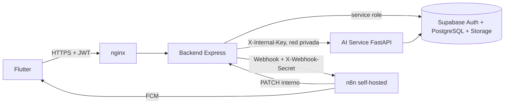

# Biomark AI: documentación técnica completa

## 1. Propósito

Biomark AI es una plataforma de salud preventiva compuesta por una aplicación Flutter, una API Node/Express, un servicio de inteligencia artificial en Python/FastAPI, Supabase como base de datos y autenticación, n8n self-hosted para automatización y nginx como entrada HTTP del VPS.

La IA orienta y detecta señales de riesgo; no sustituye una consulta médica ni confirma diagnósticos.

## 2. Arquitectura



### Componentes

| Componente | Tecnología | Responsabilidad | Exposición VPS |
|---|---|---|---|
| Frontend | Flutter | Interfaz móvil y consumo de API | Cliente externo |
| nginx | nginx 1.27 Alpine | Proxy, límite de solicitudes y bloqueo de rutas internas | Puerto 80; TLS debe añadirse |
| Backend | Node.js 22, Express 5 | Auth, RBAC, negocio, Supabase y orquestación | Solo red Docker |
| AI Service | Python 3.11, FastAPI | Chat, RAG, voz, visión y safety | Solo red Docker |
| Supabase | PostgreSQL/Auth/Storage gestionado | Persistencia, identidad y archivos | Servicio externo |
| n8n | n8nio/n8n | Automatizaciones y FCM | Red Docker; publicar solo con HTTPS |

El Compose no levanta una base local. Esto evita que los datos del VPS diverjan de Supabase, donde ya se aplicaron RLS y las migraciones.

### Despliegue distribuido: Contabo + RunPod

En producción los servicios se separan así:

```text
Flutter --HTTPS--> nginx (Contabo) --> backend (Contabo) --HTTPS--> ai-service (RunPod)
                                      |                         |
                                      +--> n8n (Contabo)         +--> Supabase
```

Contabo ejecuta `backend`, `nginx` y `n8n` mediante `docker-compose.contabo.yml`. RunPod ejecuta únicamente la imagen construida con `Dockerfile.ai-service`. Como los servidores no comparten la red Docker `biomark`, `AI_SERVICE_URL` en Contabo debe ser la URL HTTPS del proxy del puerto 8000 de RunPod, y `AI_SERVICE_INTERNAL_KEY` debe ser idéntica en ambos servidores.

El servicio `backend` es la API Express de Contabo. Para nombres gratuitos se pueden usar dos hostnames DuckDNS, por ejemplo `biomark-api.duckdns.org` para nginx/API y `biomark-n8n.duckdns.org` para n8n. La guía operativa está en `docs/DUCKDNS_CONTABO.md`.

El backend nunca debe llamar `http://ai-service:8000` en esta topología. La URL de RunPod debe usar HTTPS, almacenamiento persistente para los modelos y el caché RAG, y el endpoint del AI Service solo debe aceptar peticiones con `X-Internal-Key`. La URL puede ser técnicamente pública, pero la clave interna debe ser larga, aleatoria y rotarse si se expone.

## 3. Flujo de una conversación

1. Flutter obtiene un JWT de Supabase mediante `/api/auth/login` o Google.
2. Flutter llama `POST /api/chat` con `Authorization: Bearer <JWT>`.
3. El backend valida el JWT y resuelve `public.usuarios.id`.
4. Si existe consentimiento `CONTEXTO_MEDICO_IA`, el backend obtiene contexto clínico minimizado.
5. El backend recupera los últimos mensajes de la sesión.
6. Si el usuario autoriza ubicación, Flutter envía `latitude` y `longitude`; deben llegar juntas.
7. El backend llama al AI Service dentro de la red Docker con `X-Internal-Key`.
8. AI Service ejecuta safety de entrada, riesgo clínico, RAG, generación y validación de salida.
9. Para `/chat`, el mapper determina especialidades por palabras clave y el localizador busca un centro real por especialidad y cercanía. En riesgo `HIGH`/`CRITICAL` excluye puestos médicos cuando existe otra opción.
10. Backend persiste usuario y asistente en `sesiones_chat`/`mensajes_chat`, devuelve `centro_sugerido` y registra auditoría.
11. Riesgo `ALTO`/`CRITICO` crea una notificación en Supabase.

## 4. Flujos funcionales

### 4.1 Encuesta, perfil y consentimiento

Antes del primer chat, Flutter solicita edad, sexo biológico, enfermedades crónicas, antecedentes familiares, alergias y medicamentos actuales. Al finalizar actualiza `perfiles`, registra `CONTEXTO_MEDICO_IA` y guarda los registros clínicos correspondientes. El AI Service solo recibe ese contexto cuando el consentimiento está otorgado.

### 4.2 Chat de texto e historial

`POST /api/chat` resuelve o crea una sesión propiedad del usuario, persiste el mensaje, recupera los últimos turnos, consulta el contexto autorizado, llama al AI Service y persiste la respuesta. `GET /api/chat/history` carga la última sesión del usuario para restaurarla en Flutter.

La IA responde como orientación preventiva: no confirma diagnósticos, no prescribe dosis y solicita datos faltantes. Los saludos se resuelven de forma determinista. Las respuestas generativas usan decodificación no muestreada, límite de tokens, penalización de repetición y corte de marcadores de turnos inventados.

### 4.3 Ubicación y recomendación clínica

Flutter solicita ubicación en uso al enviar un mensaje. Si el servicio está desactivado o el permiso fue bloqueado, muestra un aviso y abre ajustes. Con coordenadas válidas, el mapper determina especialidades por síntomas y el localizador consulta `centros_salud`, calcula distancia Haversine y devuelve el centro real más cercano. En riesgo `HIGH` o `CRITICAL` se excluyen puestos no aptos cuando existe alternativa.

Si la consulta es sintomática y no llegan coordenadas, `/api/chat` devuelve `ubicacion_requerida: true`. Con coordenadas devuelve `centro_sugerido`; Flutter muestra la tarjeta y abre el mapa centrado en el centro recomendado.

### 4.4 Voz e imagen

- Voz de entrada: Flutter graba con `record` y envía multipart a `POST /api/voice`.
- Voz de salida: solo una entrada de voz genera TTS automáticamente. La respuesta contiene `audio_base64` WAV; Flutter guarda el archivo temporal, lo reproduce y muestra un control para repetirlo.
- Texto e imagen no generan audio automático.
- `POST /api/vision?tipo=piel|garganta` devuelve hallazgo, confianza, nivel de riesgo y recomendación preventiva escrita.

### 4.5 Inicio, objetivos y recordatorios

El inicio obtiene el nombre del perfil, el objetivo activo y recordatorios pendientes de hoy y mañana. Los hitos se actualizan de forma optimista en Flutter; `PATCH /api/progress/goals/:objetivoId/hitos/:hitoId` persiste el valor y, si falla, la interfaz revierte el check. Recordatorios se consultan en `/api/reminders` y se pueden completar o cancelar.

### 4.6 Web

Flutter Web comparte los contratos móviles. Ejecuta `flutter run -d chrome` para desarrollo o `flutter build web --release` para publicar `build/web`. Ubicación, cámara y micrófono requieren HTTPS y permisos del navegador; añade el origen web a `CORS_ORIGINS`.

### 4.7 Mapa comunitario y jornadas

El mapa combina cuatro capas independientes:

- **Centros de salud:** datos de `centros_salud`, ordenados por cercanía.
- **Jornadas comunitarias:** `eventos_comunitarios` futuros con título, fecha, ubicación y coordenadas; solo roles `LIDER_COMUNITARIO`, `PROMOTOR` y `ADMIN` pueden crearlas.
- **Reportes comunitarios:** cualquier usuario autenticado puede registrar desde su ubicación una descripción y cantidad aproximada de casos mediante `POST /api/community/reports`. El estado inicial es `PENDIENTE_VALIDACION`.
- **Zonas de riesgo:** zonas epidemiológicas administradas por el backend.

Flutter activa o desactiva cada capa con controles pequeños. Los reportes no aparecen individualmente ni muestran coordenadas exactas: un rol autorizado debe validarlos y el endpoint `/api/community/heatmap` devuelve puntos redondeados agregados. Esta decisión reduce exposición de ubicaciones sensibles y evita amplificar falsos positivos.

La propuesta operativa para jornadas es que un promotor o líder comunitario cree el evento con fecha, descripción, ubicación textual y coordenadas; n8n puede notificar a usuarios cercanos, mientras el evento futuro aparece como marcador azul en el mapa. Los reportes validados aparecen como círculos cuya intensidad/tamaño representa la cantidad agregada de casos.

### 4.8 Motor de Chat Offline y Base de Conocimiento MINSA

Para garantizar atención continua en zonas rurales o ante interrupciones de conectividad móvil, el frontend de Flutter cuenta con un motor clínico autónomo en memoria (`OfflineChatEngine` y `MinsaOfflineKnowledge`):

- **Catálogo normativo oficial:** Incluye directrices del Ministerio de Salud de Nicaragua:
  - *Normativa 004 y 073:* Abordaje integral del Dengue y signos de alarma (dolor abdominal continuo, vómitos persistentes, sangrado de mucosas, decaimiento extremo). Contraindicación estricta de aspirina y AINEs.
  - *Guía Clínica 153:* Enfermedad Diarreica Aguda (EDA), planes A, B y C de rehidratación oral con sales MINSA y uso de zinc.
  - *Normativa 028:* Infecciones Respiratorias Agudas (IRA), prevención de neumonía y manejo ambulatorio.
  - *Normativa 078:* Control y manejo de la Diabetes Mellitus e Hipertensión Arterial.
  - *Esquema Nacional PAI:* Calendario de vacunación infantil y del adulto.
  - *Emergencias Climáticas:* Protocolo de hidratación ante temperaturas superiores a 30°C y golpe de calor.
  - *Glosario nicaragüense y Primeros Auxilios:* Normalización de términos coloquiales (*"calentura"*, *"chavalo"*, *"sofocado"*, *"acabangado"*).
- **Algoritmo de triaje local:**
  1. *Evaluador de Banderas Rojas:* Detección de síntomas críticos inmediatos (dolor opresivo de pecho, hemorragia activa, convulsiones, disnea grave); genera alerta roja instantánea (`CRITICAL`) y orienta acudir al hospital más cercano.
  2. *Scoring semántico:* Pondera palabras clave simples y frases compuestas con coincidencia exacta y tokens lematizados.
  3. *Fallback transparente:* Si la API externa no responde o falla por timeout/red, `ChatScreen` captura la excepción sin mostrar mensajes de error molestos y presenta la respuesta con el distintivo: `Modo Sin Conexión · Guía Oficial MINSA`.

### 4.9 Sismocardiografía Torácica (SCG) para Signos Vitales

Se eliminó la fotopletismografía por linterna/cámara (PPG) y se consolidó la **Sismocardiografía (SCG)** como el método biométrico principal de la aplicación:

- **Mecanismo:** Captura las micro-vibraciones mecánicas transmitidas por la contracción ventricular al esternón utilizando el acelerómetro tridimensional y giroscopio del smartphone (`sensors_plus`).
- **Procesamiento de señal (`ScgProcessor`):**
  - Aplica un filtro pasabanda digital (10 a 30 Hz) que aísla los componentes de cierre valvular cardíaco (componentes aórtico y mitral).
  - Detección de picos sistólicos con umbral dinámico adaptativo y ventana refractaria mínima (250 ms) para prevenir dobles conteos.
  - Estimación espectral de la frecuencia cardíaca en latidos por minuto (BPM) y cálculo de índice de calidad de señal (0% a 100%).
  - Detección de perturbaciones y artefactos de movimiento del usuario.
- **Posturas clínicas:** Soporte de postura supina (acostado boca arriba, teléfono plano en el pecho) y postura sentada (con compensación del vector de gravedad estática).
- **Salida y almacenamiento:** Los resultados se clasifican clínicamente en *Normal* (60-100 BPM), *Bradicardia* (<60 BPM) o *Taquicardia* (>100 BPM), persistiendo la medición en `vitals_storage` con el método `SCG`.

### 4.10 Recomendaciones de Salud Dinámicas e Inteligentes

El módulo de recomendaciones sanitarias (`RecommendationsService` en Flutter y `/api/recommendations` en Backend) opera con un motor de priorización contextual:

- **Algoritmo de relevancia ponderada (`getPrioritized`):**
  1. *Alertas epidemiológicas territoriales activas (+10 puntos):* Cruza los brotes activos en el municipio del usuario con las categorías de la recomendación (ej. alerta de dengue en Managua eleva la tarjeta preventiva).
  2. *Padecimientos crónicos del usuario (+8 puntos):* Cruza las respuestas de la encuesta médica (`enfermedadesCronicas`) con los padecimientos objetivo de la guía (hipertensión, diabetes, asma, etc.).
  3. *Signos vitales alterados (+7 puntos):* Si la última medición de SCG detectó pulso superior a 100 o inferior a 60 BPM, prioriza automáticamente la tarjeta cardiovascular.
  4. *Tratamiento farmacológico activo (+5 puntos):* Eleva pautas de adherencia si el usuario tiene medicamentos registrados.
  5. *Geolocalización municipal (+4 puntos):* Relevancia específica para municipios con clima o condiciones particulares.
- **Insignias dinámicas:** Asigna distintivos contextuales en tiempo real (`⭐ Prioritario para tu salud`, `🚨 Alerta comunitaria activa`, `❤️ Atención a tu pulso reciente`).
- **Administración y validación:** El endpoint `POST/PUT /api/recommendations` exige rol `TRABAJADOR_SALUD`, `PROMOTOR` o `ADMIN`, garantizando que todas las tarjetas públicas estén validadas con su respectiva normativa MINSA.

### 4.11 Seguimiento Proactivo de Evolución de Síntomas

Permite al paciente registrar cómo evolucionan sus molestias a lo largo del tiempo:

- **Detección en lenguaje natural:** En `ai-service/inference/service.py`, la función `sugerir_accion()` evalúa expresiones de mejoría, persistencia o deterioro (*"ya me siento mejor"*, *"no mejoro"*, *"aún me duele"*, *"sigo con fiebre"*, *"noto mejoría"*, *"quiero registrar mi progreso"*).
- **Acción sugerida `REGISTER_PROGRESS`:** Cuando se detecta evolución, el backend emite `suggested_action: 'REGISTER_PROGRESS'`.
- **Tarjeta interactiva en el Chat:** Flutter renderiza la tarjeta interactiva `_FollowUpActionCard` con opciones de un solo toque:
  - *Mejoré* (`MEJORO`)
  - *Sigo igual* (`IGUAL`)
  - *Empeoré* (`EMPEORO`)
  - *No seguro* (`NO_SEGURO`)
- **Persistencia y retroalimentación:** Al presionar una opción, se abre el diálogo de registro y se persiste en la tabla `seguimiento_salud`. El historial de evolución previa se inyecta en el prompt del LLM en futuras sesiones para evaluar la tendencia del paciente.

### 4.12 Módulo RAG con Persistencia Incremental en ChromaDB

El componente RAG (`RagRetriever`) sincroniza documentos normativos oficiales de Supabase Storage e indexa su contenido en ChromaDB:

- **Control de Manifiesto (`chroma_db/indexed_files.json`):** Almacena el hash, timestamp (`updated_at`), tamaño en bytes y cantidad de fragmentos por archivo.
- **Metadatos por fragmento:** Cada vector almacena `{"source": nombre_archivo, "page": page_num, "chunk": chunk_id}`.
- **Persistencia diferencial (Zero Re-download / Zero Re-embedding):** Antes de descargar un PDF del bucket `documentos-minsa`, `_esta_indexado()` verifica si el archivo ya fue procesado y si permanece inalterado. En tal caso, omite completamente la descarga y el cálculo de embeddings con `SentenceTransformer`, reduciendo el tiempo de inicialización del servicio de varios segundos a milisegundos.
- **Actualización atómica:** Si un archivo cambia en Supabase, el sistema purga los fragmentos obsoletos mediante `collection.delete(where={"source": nombre_archivo})` y re-indexa únicamente la nueva versión.

### 4.13 Integración del Modelo Hugging Face (`BiomarkAI/Biomark-AI-Produccion`)

El servicio de inferencia está adaptado al modelo especializado `BiomarkAI/Biomark-AI-Produccion` (basado en BioMistral 7B / Mistral Instruct):

- **Plantilla de chat Jinja estricta:** La plantilla del tokenizador de Mistral solo admite roles `user` y `assistant`, lanzando una excepción si recibe un rol `system`.
- **Compatibilidad del prompt:** En `generator.py`, se consolidan las instrucciones de la persona clínica (`PERSONA_BIOMARK`), las 6 reglas obligatorias de triaje y el contexto médico del paciente directamente dentro del primer turno `user`.
- **Generación:** `tokenizer.apply_chat_template` produce de forma limpia el bloque `<s>[INST] ... [/INST]`, evitando la alucinación de tokens de control o falsos turnos adicionales.

### 4.14 Sistema de Diseño Glassmorphism y Accesibilidad (WCAG AAA)

La interfaz gráfica incorpora un lenguaje de diseño moderno basado en superficies translúcidas con desenfoque de fondo:

- **Componente `BiomarkGlassSurface`:** Emplea `BackdropFilter` con desenfoque gaussiano (`sigma: 12.0`), tintes translúcidos adaptativos a modo claro y oscuro, bordes pulidos de 1.0 px y sombras suaves.
- **Accesibilidad y Alto Contraste:** Si el usuario activa el modo de **Alto Contraste** en `AppThemeController`, el componente conmuta automáticamente a fondos 100% sólidos con bordes nítidos de 2.0 px en blanco o negro, garantizando un ratio de contraste superior a 7:1 (cumplimiento WCAG AAA).
- **Auditoría Antisolapamiento:** Se integraron `LayoutBuilder`, `SingleChildScrollView`, `IntrinsicHeight` y restricciones de altura mínima para asegurar que ningún dispositivo sufra errores de `RenderFlex overflowed`.

### 4.15 Mapa GIS de Alta Precisión y Centros de Salud

El módulo GIS (`GisMapScreen`) optimiza la ubicación y acceso a servicios médicos:

- **GPS de alta precisión:** Configuración `LocationAccuracy.high` en `Geolocator` para obtener coordenadas exactas en metros.
- **Filtros rápidos:** Chips interactivos para filtrar por categoría: *Todos*, *Hospitales* (Nivel 3), *Centros de Salud* (Nivel 2) y *Puestos Médicos* (Nivel 1).
- **Distancia geodésica en tiempo real:** Cálculo de distancia Haversine exacta al usuario y formateo inteligente (`250 m` o `1.4 km`) visible en el marcador y en el panel deslizable inferior (`_CenterSheet`).

### 4.16 Baja y Eliminación Completa de Cuenta de Usuario

Para dar estricto cumplimiento a los derechos de privacidad y protección de datos sanitarios (RGPD y normativas locales):

- **Procedimiento en Base de Datos:** La función `eliminar_cuenta_usuario(usuario_uuid)` en `010_eliminar_cuenta_usuario.sql` ejecuta un borrado transaccional en cascada de: `perfiles`, `historial_medico`, `alergias`, `medicamentos`, `antecedentes_familiares`, `vacunas`, `sintomas`, `seguimiento_salud`, `recordatorios`, `sesiones_chat`, `mensajes_chat`, `consentimientos`, `dispositivos_push` y la cuenta de `auth.users`.
- **Endpoint seguro:** Expuesto en `DELETE /api/auth/account`, protegido con JWT del usuario activo.

## 5. Estructura modular

```text
backend/src/
  app.js                         Express, middleware, healthchecks y rutas
  index.js                       Arranque HTTP
  config/                        Supabase, AI Service y n8n
  middleware/                    JWT, RBAC, validación, errores y webhooks
  modules/
    auth/                        Registro, login, Google, refresh, logout y eliminación de cuenta
    users/                       Perfil, foto de perfil, consentimiento y tokens push
    medical/                     Historial, alergias, medicamentos y familia
    symptoms/                    Síntomas y registros asociados
    vaccines/                    Vacunas y recomendaciones
    reminders/                   Recordatorios, frecuencias, aviso previo y eventos n8n
    recommendations/             Recomendaciones comunitarias, validación MINSA y scoring
    progress/                    Evolución de síntomas, metas e hitos
    chat/                        Sesiones, contexto y conversación
    voice/                       ASR/TTS y conversación por voz
    vision/                      Análisis de piel/garganta y Storage
    community/                   Eventos, reportes, heatmap y estadísticas
    epidemiology/                Reportes, alertas y zonas de riesgo
    gis/                         Centros, eventos, mapa y navegación
    notifications/               Notificaciones persistidas
  utils/                         Errores, geo, riesgo y usuario

ai-service/
  main.py                        API FastAPI interna
  config.py                      Entorno y configuración de modelos
  safety/                        Safety Layer y validación de respuesta
  inference/                     Modelo BioMistral 7B, generación y servicio clínico
  rag/                           Recuperación con persistencia incremental en ChromaDB
  voice/                         ASR y TTS
  vision/                        Clasificadores
  gis/                           Centros cercanos y mapper de especialidades

frontend/flutter/lib/
  core/
    design/                      BiomarkGlassSurface, responsive layout, tema y colores
    auth/                        Sesión y autenticación
    config/                      Configuración de endpoints
  features/
    chat/
      data/                      MinsaOfflineKnowledge, OfflineChatEngine y API
      presentation/              ChatScreen, burbujas y tarjetas interactivas
    vitals/
      data/                      VitalsStorage
      domain/                    VitalMeasurement (SCG)
      presentation/              ScgScreen y ScgProcessor
    home/
      data/                      RecommendationsService (priorización contextual)
      presentation/              HomeScreen y tarjetas glassmorphism
    gis/
      presentation/              GisMapScreen (filtros y geolocalización de precisión)
    progress/
      presentation/              ProgressScreen (evolución de síntomas e hitos)

database/migrations/             Migraciones aplicadas en Supabase (001 a 013)
docs/                            OpenAPI, Postman y manuales técnicos
docker-compose.contabo.yml       Compose de producción para Contabo
database/seeds/                  Datasets iniciales controlados
```

Cada archivo de código incluye un encabezado breve con su responsabilidad.

## 6. Dependencias

### Backend

Las dependencias se definen en `backend/package.json`: Express, Supabase JS, Axios, CORS, dotenv, Helmet, express-rate-limit, FormData, Multer y Zod.

### AI Service

Las dependencias se definen en `ai-service/requirements.txt`: FastAPI/Uvicorn, Supabase, PyTorch, Transformers, PEFT, Sentence Transformers, ChromaDB, pypdf, Whisper, TTS, TensorFlow, scikit-learn, Pillow, NumPy y Hugging Face Hub.

El AI Service puede requerir varios GB de RAM. El Compose usa un worker para evitar duplicar modelos en memoria.

## 7. Seguridad

- Todo endpoint de dominio usa JWT y resuelve propiedad mediante `req.usuarioId`.
- RBAC limita escritura epidemiológica y organización comunitaria.
- `SUPABASE_SERVICE_ROLE_KEY` solo vive en backend/AI Service, nunca en Flutter.
- AI Service solo acepta `X-Internal-Key` en inferencia.
- n8n usa `X-Webhook-Secret` para eventos y confirmación interna.
- nginx bloquea `/internal/` externamente.
- Helmet, CORS configurable, límites de payload y rate limiting están activos.
- Las imágenes médicas se guardan en Storage privado y se acceden con URL firmada.
- RLS debe permanecer activo en Supabase, aunque el backend use service role.
- No registrar tokens, contraseñas, service role keys ni contenido médico completo en logs.

Antes de VPS, rotar las claves que hayan estado en archivos locales o conversaciones.

## 8. Base de datos

Las tablas principales son `usuarios`, `perfiles`, `historial_medico`, `alergias`, `medicamentos`, `antecedentes_familiares`, `vacunas`, `sintomas`, `registros_sintomas`, `seguimiento_salud`, `objetivos_salud`, `hitos_objetivo`, `recomendaciones_salud`, `solicitudes_rol_promotor`, `eventos_medicos`, `imagenes_medicas`, `recordatorios`, `notificaciones`, `sesiones_chat`, `mensajes_chat`, `centros_salud`, `eventos_comunitarios`, `zonas_riesgo`, `reportes_epidemiologicos`, `alertas_epidemiologicas`, `reportes_comunitarios`, `registros_auditoria`, `consentimientos` y `dispositivos_push`.

Las migraciones aplicadas de forma secuencial en Supabase son:
- `002_auditoria_operativa.sql`: Auditoría de operaciones críticas.
- `003_dispositivos_push.sql`: Registro de tokens FCM para notificaciones.
- `004_seguimiento_evolucion.sql`: Tabla `seguimiento_salud` para evolución de síntomas (`MEJORO`, `IGUAL`, `EMPEORO`, `NO_SEGURO`).
- `005_centros_salud_recomendador.sql`: Campos enriquecidos para centros y geolocalización.
- `006_objetivos_mejoria.sql`: Metas de salud e hitos interactivos.
- `007_solicitudes_roles.sql`: Solicitudes y revisión administrativa para rol de Promotor de Salud.
- `008_flujo_promotor.sql`: Permisos y asignación territorial para promotores.
- `009_fotos_perfil.sql`: Soporte de avatar y fotos de perfil en Storage.
- `010_eliminar_cuenta_usuario.sql`: Función RPC transaccional para baja definitiva de cuenta y borrado en cascada de datos de salud.
- `011_recordatorios_frecuencia.sql`: Frecuencias avanzadas de recordatorios (`DIARIA`, `SEMANAL`, etc.).
- `012_recordatorios_aviso_previo.sql`: Anticipación configurable para notificaciones.
- `013_recomendaciones_salud.sql`: Catálogo y administración de recomendaciones de salud con validación normativa MINSA.

Después de `005` debe cargarse `database/seeds/seed_centros_salud_managua.sql`.

`centros_salud.tipo` usa el enum `tipo_centro_salud`; `tipo_unidad` conserva la descripción operativa, por ejemplo `Hospital Referencia Nacional`. `especialidades` es un array de texto y debe mantenerse sincronizado con `ai-service/gis/specialty_mapper.py`.

El backend espera que los enums de Supabase tengan exactamente los valores usados por los validadores: `USUARIO`, `TRABAJADOR_SALUD`, `LIDER_COMUNITARIO`, `PROMOTOR`, `ADMIN`, `BAJO`, `MODERADO`, `ALTO`, `CRITICO`, entre otros tipos definidos por el esquema.

## 9. Automatizaciones n8n

Al crear un recordatorio, el backend publica `recordatorio.creado` en `N8N_WEBHOOK_URL`. El workflow debe:

1. Validar `X-Webhook-Secret`.
2. Leer el `recordatorio` y `usuario_id`.
3. Buscar tokens activos en `dispositivos_push`.
4. Enviar FCM.
5. Llamar `PATCH /internal/reminders/:id/sent` con el secreto.
6. Reintentar fallos transitorios y no duplicar envíos.

n8n conserva su configuración en el volumen `n8n_data`. Fijar una versión de imagen en producción y respaldar ese volumen.

La configuracion de push esta separada por responsabilidad: Flutter conserva los tokens FCM y la configuracion publica Web; el backend registra los tokens en `dispositivos_push`; n8n envia FCM HTTP v1 con `FCM_PROJECT_ID` y una credencial Google API; Firebase Admin del backend se configura con `FIREBASE_PROJECT_ID`, `FIREBASE_CLIENT_EMAIL` y `FIREBASE_PRIVATE_KEY` cuando se necesita inicializar el SDK. La referencia operativa completa esta en [ENVIRONMENT_VARIABLES.md](ENVIRONMENT_VARIABLES.md).

## 10. Pruebas

```bash
npm --prefix backend test
(cd ai-service && python3 -m unittest discover -p 'test*.py')
find backend/src -name '*.js' -print0 | xargs -0 -n1 node --check
python3 -m compileall -q ai-service
```

Las pruebas unitarias no sustituyen pruebas de integración con Supabase staging, FCM, n8n y un dispositivo Flutter real.

## 11. Observabilidad y operación

```bash
docker compose --env-file deploy/.env ps
docker compose logs -f backend ai-service n8n
docker compose restart backend
docker compose up -d --build
curl https://DOMINIO/health
curl https://DOMINIO/ready
```

Monitorizar CPU/RAM/disco, errores 4xx/5xx, latencia del AI Service, volumen de n8n y espacio de ChromaDB. Configurar backups de Supabase y del volumen `n8n_data`.
