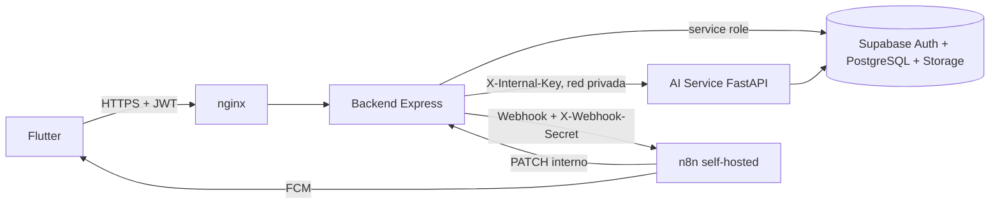

# Biomark AI: documentación técnica completa

## 1. Propósito

Biomark AI es una plataforma de salud preventiva compuesta por una aplicación Flutter, una API Node/Express, un servicio de inteligencia artificial en Python/FastAPI, Supabase como base de datos y autenticación, n8n self-hosted para automatización y nginx como entrada HTTP del VPS.

La IA orienta y detecta señales de riesgo; no sustituye una consulta médica ni confirma diagnósticos.

## 2. Arquitectura



### Componentes

| Componente | Tecnología | Responsabilidad | Exposición VPS |
|---|---|---|---|
| Frontend | Flutter | Interfaz móvil y consumo de API | Cliente externo |
| nginx | nginx 1.27 Alpine | Proxy, límite de solicitudes y bloqueo de rutas internas | Puerto 80; TLS debe añadirse |
| Backend | Node.js 22, Express 5 | Auth, RBAC, negocio, Supabase y orquestación | Solo red Docker |
| AI Service | Python 3.11, FastAPI | Chat, RAG, voz, visión y safety | Solo red Docker |
| Supabase | PostgreSQL/Auth/Storage gestionado | Persistencia, identidad y archivos | Servicio externo |
| n8n | n8nio/n8n | Automatizaciones y FCM | Red Docker; publicar solo con HTTPS |

El Compose no levanta una base local. Esto evita que los datos del VPS diverjan de Supabase, donde ya se aplicaron RLS y las migraciones.

### Despliegue distribuido: Contabo + RunPod

En producción los servicios se separan así:

```text
Flutter --HTTPS--> nginx (Contabo) --> backend (Contabo) --HTTPS--> ai-service (RunPod)
                                      |                         |
                                      +--> n8n (Contabo)         +--> Supabase
```

Contabo ejecuta `backend`, `nginx` y `n8n` mediante `docker-compose.contabo.yml`. RunPod ejecuta únicamente la imagen construida con `Dockerfile.ai-service`. Como los servidores no comparten la red Docker `biomark`, `AI_SERVICE_URL` en Contabo debe ser la URL HTTPS del proxy del puerto 8000 de RunPod, y `AI_SERVICE_INTERNAL_KEY` debe ser idéntica en ambos servidores.

El backend nunca debe llamar `http://ai-service:8000` en esta topología. La URL de RunPod debe usar HTTPS, almacenamiento persistente para los modelos y el caché RAG, y el endpoint del AI Service solo debe aceptar peticiones con `X-Internal-Key`. La URL puede ser técnicamente pública, pero la clave interna debe ser larga, aleatoria y rotarse si se expone.

## 3. Flujo de una conversación

1. Flutter obtiene un JWT de Supabase mediante `/api/auth/login` o Google.
2. Flutter llama `POST /api/chat` con `Authorization: Bearer <JWT>`.
3. El backend valida el JWT y resuelve `public.usuarios.id`.
4. Si existe consentimiento `CONTEXTO_MEDICO_IA`, el backend obtiene contexto clínico minimizado.
5. El backend recupera los últimos mensajes de la sesión.
6. Si el usuario autoriza ubicación, Flutter envía `latitude` y `longitude`; deben llegar juntas.
7. El backend llama al AI Service dentro de la red Docker con `X-Internal-Key`.
8. AI Service ejecuta safety de entrada, riesgo clínico, RAG, generación y validación de salida.
9. Para `/chat`, el mapper determina especialidades por palabras clave y el localizador busca un centro real por especialidad y cercanía. En riesgo `HIGH`/`CRITICAL` excluye puestos médicos cuando existe otra opción.
10. Backend persiste usuario y asistente en `sesiones_chat`/`mensajes_chat`, devuelve `centro_sugerido` y registra auditoría.
11. Riesgo `ALTO`/`CRITICO` crea una notificación en Supabase.

## 4. Estructura modular

```text
backend/src/
  app.js                         Express, middleware, healthchecks y rutas
  index.js                       Arranque HTTP
  config/                        Supabase, AI Service y n8n
  middleware/                    JWT, RBAC, validación, errores y webhooks
  modules/
    auth/                        Registro, login, Google, refresh y logout
    users/                       Perfil, consentimiento y tokens push
    medical/                     Historial, alergias, medicamentos y familia
    symptoms/                    Síntomas y registros asociados
    vaccines/                    Vacunas y recomendaciones
    reminders/                   Recordatorios y eventos n8n
    chat/                        Sesiones, contexto y conversación
    voice/                       ASR/TTS y conversación por voz
    vision/                      Análisis de piel/garganta y Storage
    community/                   Eventos, reportes, heatmap y estadísticas
    epidemiology/                Reportes, alertas y zonas de riesgo
    gis/                         Centros, eventos, mapa y navegación
    notifications/               Notificaciones persistidas
  utils/                         Errores, geo, riesgo y usuario

ai-service/
  main.py                        API FastAPI interna
  config.py                      Entorno y configuración de modelos
  safety/                        Safety Layer y validación de respuesta
  inference/                     Modelo, generación y servicio clínico
  rag/                            Recuperación de documentos MINSA
  voice/                         ASR y TTS
  vision/                        Clasificadores
  gis/                            Centros cercanos

database/migrations/             Migraciones aplicadas en Supabase
docs/                            OpenAPI, Postman y manuales
docker-compose.contabo.yml       Compose de producción para Contabo
database/seeds/                   Datasets iniciales controlados
```

Cada archivo de código incluye un encabezado breve con su responsabilidad.

## 5. Dependencias

### Backend

Las dependencias se definen en `backend/package.json`: Express, Supabase JS, Axios, CORS, dotenv, Helmet, express-rate-limit, FormData, Multer y Zod.

### AI Service

Las dependencias se definen en `ai-service/requirements.txt`: FastAPI/Uvicorn, Supabase, PyTorch, Transformers, PEFT, Sentence Transformers, ChromaDB, pypdf, Whisper, TTS, TensorFlow, scikit-learn, Pillow, NumPy y Hugging Face Hub.

El AI Service puede requerir varios GB de RAM. El Compose usa un worker para evitar duplicar modelos en memoria.

## 6. Seguridad

- Todo endpoint de dominio usa JWT y resuelve propiedad mediante `req.usuarioId`.
- RBAC limita escritura epidemiológica y organización comunitaria.
- `SUPABASE_SERVICE_ROLE_KEY` solo vive en backend/AI Service, nunca en Flutter.
- AI Service solo acepta `X-Internal-Key` en inferencia.
- n8n usa `X-Webhook-Secret` para eventos y confirmación interna.
- nginx bloquea `/internal/` externamente.
- Helmet, CORS configurable, límites de payload y rate limiting están activos.
- Las imágenes médicas se guardan en Storage privado y se acceden con URL firmada.
- RLS debe permanecer activo en Supabase, aunque el backend use service role.
- No registrar tokens, contraseñas, service role keys ni contenido médico completo en logs.

Antes de VPS, rotar las claves que hayan estado en archivos locales o conversaciones.

## 7. Base de datos

Las tablas principales son `usuarios`, `perfiles`, `historial_medico`, `alergias`, `medicamentos`, `antecedentes_familiares`, `vacunas`, `sintomas`, `registros_sintomas`, `eventos_medicos`, `imagenes_medicas`, `recordatorios`, `notificaciones`, `sesiones_chat`, `mensajes_chat`, `centros_salud`, `eventos_comunitarios`, `zonas_riesgo`, `reportes_epidemiologicos`, `alertas_epidemiologicas`, `reportes_comunitarios`, `registros_auditoria`, `consentimientos` y `dispositivos_push`.

Las migraciones `002_auditoria_operativa.sql`, `003_dispositivos_push.sql`, `004_seguimiento_evolucion.sql` y `005_centros_salud_recomendador.sql` agregan auditoría, push, seguimiento y campos de centros enriquecidos. Después de `005` debe cargarse `database/seeds/seed_centros_salud_managua.sql`.

`centros_salud.tipo` usa el enum `tipo_centro_salud`; `tipo_unidad` conserva la descripción operativa, por ejemplo `Hospital Referencia Nacional`. `especialidades` es un array de texto y debe mantenerse sincronizado con `ai-service/gis/specialty_mapper.py`.

El backend espera que los enums de Supabase tengan exactamente los valores usados por los validadores: `USUARIO`, `TRABAJADOR_SALUD`, `LIDER_COMUNITARIO`, `PROMOTOR`, `ADMIN`, `BAJO`, `MODERADO`, `ALTO`, `CRITICO`, entre otros tipos definidos por el esquema.

## 8. Automatizaciones n8n

Al crear un recordatorio, el backend publica `recordatorio.creado` en `N8N_WEBHOOK_URL`. El workflow debe:

1. Validar `X-Webhook-Secret`.
2. Leer el `recordatorio` y `usuario_id`.
3. Buscar tokens activos en `dispositivos_push`.
4. Enviar FCM.
5. Llamar `PATCH /internal/reminders/:id/sent` con el secreto.
6. Reintentar fallos transitorios y no duplicar envíos.

n8n conserva su configuración en el volumen `n8n_data`. Fijar una versión de imagen en producción y respaldar ese volumen.

## 9. Pruebas

```bash
npm --prefix backend test
(cd ai-service && python3 -m unittest discover -p 'test*.py')
find backend/src -name '*.js' -print0 | xargs -0 -n1 node --check
python3 -m compileall -q ai-service
```

Las pruebas unitarias no sustituyen pruebas de integración con Supabase staging, FCM, n8n y un dispositivo Flutter real.

## 10. Observabilidad y operación

```bash
docker compose --env-file deploy/.env ps
docker compose logs -f backend ai-service n8n
docker compose restart backend
docker compose up -d --build
curl https://DOMINIO/health
curl https://DOMINIO/ready
```

Monitorizar CPU/RAM/disco, errores 4xx/5xx, latencia del AI Service, volumen de n8n y espacio de ChromaDB. Configurar backups de Supabase y del volumen `n8n_data`.
