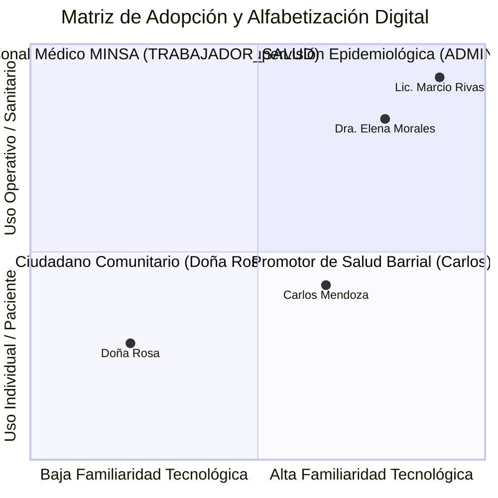
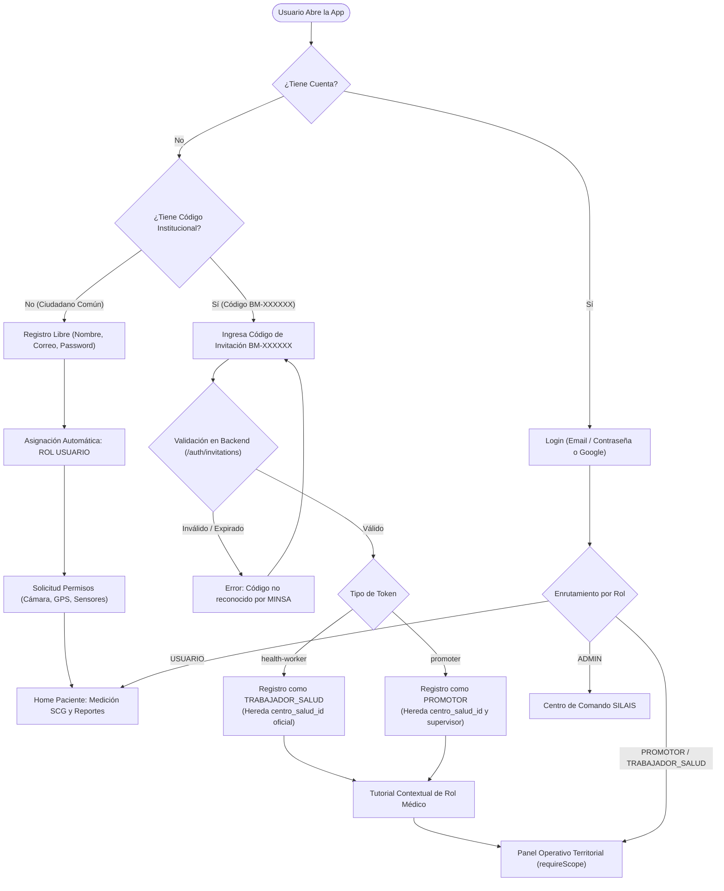
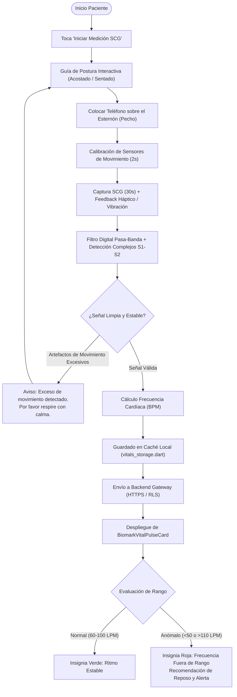
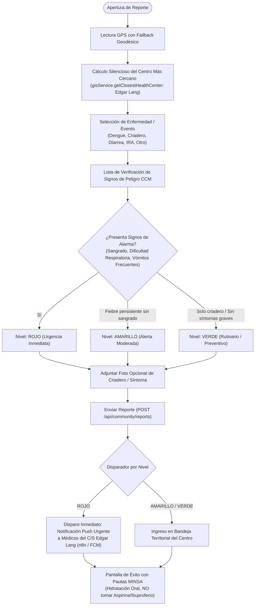
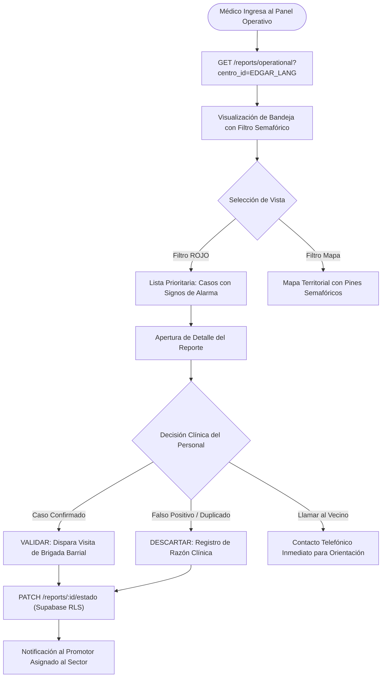
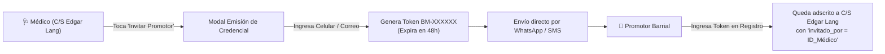
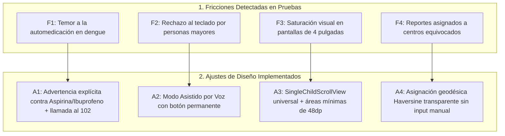

# Validación y Ajuste de Flujo UX — Biomark AI
### Especificación Técnica de User Flows, Wireframes y Evaluación Heurística
**Piloto Sanitario:** Managua (Distritos II y III — Centros Edgar Lang y Sócrates Flores)  
**Versión:** 2.0.0 | **Estándar:** Centrado en el Usuario (UCD) & WCAG 2.1 AA / AAA

---

## 1. Contexto y Objetivos de la Validación UX

**Biomark AI** es una plataforma sanitaria móvil y web desarrollada para conectar a ciudadanos, promotores de salud barriales y personal médico del Ministerio de Salud (MINSA). En contextos comunitarios reales —donde los usuarios enfrentan condiciones de conectividad celular inestable, equipos móviles de gama baja y niveles diversos de alfabetización digital— la experiencia de usuario (UX) no puede ser genérica ni restrictiva.

### Objetivos Clave de la Validación y Ajuste UX:
1. **Erradicar la autoasignación no regulada de roles:** Garantizar que los privilegios clínicos se adquieran mediante una cadena de confianza institucional delegada (Cascade Trust Governance) sin fricción en el registro.
2. **Minimizar el tiempo de reporte epidemiológico:** Reducir de 7 minutos a menos de 90 segundos la captura de síntomas barriales y signos de peligro mediante selectores visuales por chips.
3. **Optimizar la comprensión del riesgo clínico (CCM):** Eliminar la ambigüedad en los resultados mediante un semáforo universal de tres niveles (**ROJO**, **AMARILLO**, **VERDE**) alineado a los protocolos del MINSA.
4. **Accesibilidad total para grupos vulnerables:** Habilitar interacción mediante voz natural y modo de alto contraste para adultos mayores o personas con discapacidad visual.

---

## 2. Arquetipos de Usuario (User Personas)



### 👤 Arquetipo 1: Doña Rosa Martínez (Ciudadana / Paciente)
* **Edad:** 52 años | **Ubicación:** Barrio San Judas, Distrito III, Managua.
* **Perfil:** Ama de casa, celular Android gama de entrada con pantalla de 5.5", conexión móvil prepago intermitente.
* **Necesidad:** Monitorear su presión y frecuencia cardíaca cuando siente mareos, y reportar una zanja con criaderos de zancudos frente a su casa.
* **Fricción previa:** Textos médicos confusos, formularios extensos con teclado pequeño y miedo a equivocarse.
* **Solución UX:** Modo Asistido por Voz con botón flotante grande, formulario simplificado de reporte con chips ilustrados y cálculo automático del centro de salud más cercano (C/S Edgar Lang).

### 🤝 Arquetipo 2: Carlos Mendoza (Promotor de Salud Comunitario)
* **Edad:** 34 años | **Ubicación:** Red Comunitaria MINSA, Sector San Judas.
* **Perfil:** Líder comunitario voluntario que recorre barrios casa a casa en jornadas de salud y abatización.
* **Necesidad:** Registrar casos sospechosos en terreno sin depender de señal celular activa y comunicar alertas a la enfermera de su centro.
* **Fricción previa:** Pérdida de datos por falta de señal y falta de identificación institucional clara.
* **Solución UX:** Registro institucional con código de invitación `BM-XXXXXX`, almacenamiento offline automático (`OfflineChatEngine` y caché local) e insignia de Promotor acreditado por su centro.

### 🩺 Arquetipo 3: Dra. Elena Morales (Trabajadora de Salud / Médico General)
* **Edad:** 41 años | **Ubicación:** Centro de Salud Edgar Lang, Managua.
* **Perfil:** Médico encargado de la vigilancia epidemiológica y consulta externa.
* **Necesidad:** Triaje rápido de casos comunitarios, priorización de urgencias (signos de alarma de dengue o neumonía) y supervisión de los 15 promotores de su sector.
* **Fricción previa:** Saturación con reportes de otros distritos de Managua y retraso en enterarse de casos graves.
* **Solución UX:** Bandeja operativa territorial acotada a su jurisdicción (`requireScope`), priorización semafórica con alertas rojas en la cabecera y emisión de códigos de invitación para sus promotores en un solo clic.

### 🏛️ Arquetipo 4: Lic. Marcio Rivas (Administrador Departamental SILAIS)
* **Edad:** 48 años | **Ubicación:** SILAIS Managua / MINSA Central.
* **Perfil:** Director de epidemiología y estadísticas departamentales.
* **Necesidad:** Vista panorámica de brotes en los distritos II y III, control de centros activos y emisión de alertas oficiales.
* **Solución UX:** Tablero consolidado con mapa de calor GIS multicapa y acreditación de personal médico.

---

## 3. Flujos de Usuario Actualizados (User Flows)

### 3.1 Flujo 1: Registro, Autenticación y Gobernanza en Cascada

Este flujo elimina el riesgo de autoasignación de privilegios médicos y simplifica el ingreso ciudadano:



---

### 3.2 Flujo 2: Medición de Signos Vitales (SCG / PPG) y Monitoreo Fisiológico

El paciente realiza la medición de sismocardiografía (SCG) mediante el acelerómetro del dispositivo colocado sobre el pecho:



---

### 3.3 Flujo 3: Reporte Comunitario Barrial y Triaje Semafórico CCM

El ciudadano o promotor reporta una situación de riesgo sanitario o sospecha clínica:



---

### 3.4 Flujo 4: Bandeja Operativa Territorial del Trabajador de Salud

El médico o enfermero gestiona los reportes dentro de su sector (`requireScope`):



---

### 3.5 Flujo 5: Supervisión y Emisión de Invitaciones en Cascada



---

## 4. Wireframes Estructurales de Alta Fidelidad (Blueprints)

A continuación se presentan los planos de interfaz para dispositivos móviles (360-412 dp) y adaptabilidad a pantallas medianas.

### 📱 Wireframe W-01: Registro de Cuenta y Código Institucional (`RegisterScreen`)

```
+--------------------------------------------------+
|  BIOMARK AI                           [ Idioma ] |
|  Sistema Comunitario de Salud — MINSA Managua   |
+--------------------------------------------------+
|                                                  |
|   [ Iniciar Sesión ]      [ REGISTRARSE (Activo) ]|
|  ----------------------------------------------  |
|                                                  |
|   Nombre Completo *                              |
|   [ María González                             ] |
|                                                  |
|   Correo Electrónico *                           |
|   [ maria.gonzalez@gmail.com                   ] |
|                                                  |
|   Contraseña *                                   |
|   [ ••••••••••••                        ( O )  ] |
|                                                  |
|   ¿Tienes Código Institucional MINSA? (Opcional) |
|   +--------------------------------------------+ |
|   |  [Ícono Llave]  Código: BM-847291          | |
|   |  (Para Promotores y Personal de Salud)     | |
|   +--------------------------------------------+ |
|   * Si no tienes código, ingresarás como Ciudadano|
|                                                  |
|   [v] Acepto los Términos de Privacidad y Salud  |
|                                                  |
|   +--------------------------------------------+ |
|   |     CREAR MI CUENTA DE SALUD  (Verde)      | |
|   +--------------------------------------------+ |
|                                                  |
|   ------------- O CONTINUAR CON -------------   |
|   +--------------------------------------------+ |
|   |  [G] Continuar con Google                  | |
|   +--------------------------------------------+ |
+--------------------------------------------------+
```

---

### 📱 Wireframe W-02: Pantalla Principal del Paciente / Ciudadano (`HomeScreen`)

```
+--------------------------------------------------+
|  [Avatar M]  Hola, María         [Campana Notif 2]|
|              CIUDADANO • C/S Edgar Lang (San Judas)|
+--------------------------------------------------+
|  +----------------------------------------------+|
|  | [Micrófono] MODO ASISTIDO POR VOZ      [ X ] ||
|  | Habla con tu asistente sin leer ni escribir  ||
|  +----------------------------------------------+|
|                                                  |
|  SIGNOS VITALES RECIENTES            [ Historial >]|
|  +----------------------------------------------+|
|  | [Corazón] Frecuencia Cardíaca    [ RITMO NORMAL]||
|  |                                              ||
|  |   74  LPM (latidos por minuto)               ||
|  |   Última toma: Hoy, 08:30 AM                 ||
|  |                                              ||
|  |   +----------------------------------------+ ||
|  |   | [Sensors] TOMAR MEDICIÓN SCG (Pecho)   | ||
|  |   +----------------------------------------+ ||
|  +----------------------------------------------+|
|                                                  |
|  VIGILANCIA EN TU COMUNIDAD          [ Reportar + ]|
|  +----------------------------------------------+|
|  | 🟢 CASO VERDE: Sin alertas graves en tu calle||
|  | 2 Jornadas activas de abatización cerca de ti||
|  +----------------------------------------------+|
|                                                  |
|  CÁPSULAS DE SALUD MINSA                        |
|  +----------------------------------------------+|
|  | [Tag DENGUE] • 3 min lectura                  ||
|  | Síntomas de alarma y eliminación de criaderos||
|  | En temporada de lluvia, revise barriles...   ||
|  +----------------------------------------------+|
|                                                  |
+--------------------------------------------------+
| [Inicio]  [Evolución]  [Mapa]  [Recordatorio] [Perfil]|
+--------------------------------------------------+
```

---

### 📱 Wireframe W-03: Medición de Signos Vitales por Sismocardiografía (`ScgScreen`)

```
+--------------------------------------------------+
|  [< Atrás]  Sismocardiografía (SCG)     [ Ayuda ? ]|
|             Medición mediante acelerómetro torácico|
+--------------------------------------------------+
|                                                  |
|   PASO 1: SELECCIONA TU POSTURA ACTUAL           |
|   +---------------------+  +--------------------+|
|   | [Icono Cama]        |  | [Icono Silla]      ||
|   | ACOSTADO (Recomend) |  | SENTADO EN REPOSO  ||
|   | (Seleccionado Verde)|  | (Delineado Gris)   ||
|   +---------------------+  +--------------------+|
|                                                  |
|   PASO 2: COLOCACIÓN DEL DISPOSITIVO             |
|   +--------------------------------------------+ |
|   |        [ ILUSTRACIÓN ANATÓMICA ]          | |
|   | Coloca la parte trasera del teléfono en el | |
|   | centro de tu pecho (sobre el esternón).    | |
|   | Respira con normalidad y no hables.        | |
|   +--------------------------------------------+ |
|                                                  |
|   ESTADO DE LA SEÑAL: LISTO Y ESTABLE (🟢)       |
|                                                  |
|   +--------------------------------------------+ |
|   |    INICIAR MEDICIÓN EN EL PECHO (30s)     | |
|   +--------------------------------------------+ |
|   * Sentirás una vibración cuando la toma termine|
+--------------------------------------------------+
```

---

### 📱 Wireframe W-04: Formulario de Reporte Comunitario con Triaje CCM (`CommunityReportScreen`)

```
+--------------------------------------------------+
|  [< Atrás]  Nuevo Reporte Comunitario  [ Ayuda ? ]|
|             Centro Asignado: C/S Edgar Lang (GPS) |
+--------------------------------------------------+
|                                                  |
|   Tipo de Evento o Enfermedad Sospechosa *       |
|   [ Dengue / Fiebre Sospechosa              (v) ]|
|                                                  |
|   Dirección Exacta o Punto de Referencia *       |
|   [ De la Iglesia San Judas 2c al sur, casa #42 ]|
|                                                  |
|   SELECCIÓN DE SÍNTOMAS (Toca los que apliquen): |
|   [x Fiebre Alta]   [x Dolor Detrás Ojos]         |
|   [x Dolores Articulares]   [  Manchas Rojas ]    |
|   [  Sangrado de Encías ]   [  Vómitos Frecuentes]|
|                                                  |
|   ¿HAY SIGNOS DE ALARMA O PELIGRO GRAVE?         |
|   +--------------------------------------------+ |
|   |  ( ! ) ALERTA ROJA CCM:                     | |
|   |  Si el paciente tiene sangrado, frialdad en| |
|   |  manos o desmayo, márcalo aquí.            | |
|   |                                            | |
|   |  [ ] SÍ, PRESENTA SIGNOS DE ALARMA GRAVE   | |
|   +--------------------------------------------+ |
|                                                  |
|   FOTO DEL LUGAR O CRIADERO (Opcional)           |
|   +--------------------------------------------+ |
|   |  [ Cámara ]  Tomar Foto de Depósito / Agua | |
|   +--------------------------------------------+ |
|                                                  |
|   +--------------------------------------------+ |
|   |       ENVIAR REPORTE AL CENTRO MINSA       | |
|   +--------------------------------------------+ |
+--------------------------------------------------+
```

---

### 📱 Wireframe W-05: Bandeja de Triaje Operativo para Personal de Salud (`PromoterDashboardScreen`)

```
+--------------------------------------------------+
|  [Avatar Dr]  Dra. Elena Morales    [Campana (3)] |
|               MÉDICO • C/S Edgar Lang (San Judas) |
+--------------------------------------------------+
|                                                  |
|   JURISDICCIÓN: Distrito III — Sector Edgar Lang  |
|   [ 🔴 2 Urgencias ]  [ 🟡 5 Alertas ]  [ 🟢 12 OK]|
|                                                  |
|   FILTRO RÁPIDO:                                 |
|   [ TODOS (19) ] [ ROJO (2) * ] [ AMARILLO (5) ] |
|                                                  |
|   BANDEJA DE CASOS TERRITORIALES:                |
|   +--------------------------------------------+ |
|   | 🔴 ROJO — URGENCIA INMEDIATA     Hace 12m | |
|   | Sospecha Dengue Grave (Sangrado)           | |
|   | Paciente: Juan Pérez, 14 años              | |
|   | Barrio San Judas, del parque 1c abajo      | |
|   | [ VER DETALLE ]   [ 📞 LLAMAR ] [ VALIDAR]| |
|   +--------------------------------------------+ |
|   +--------------------------------------------+ |
|   | 🟡 AMARILLO — PRIORIDAD MODERADA  Hace 1h  | |
|   | Fiebre de 4 días y dolor articular         | |
|   | Paciente: Sofía Calero, 29 años            | |
|   | Barrio Loma Linda                          | |
|   | [ VER DETALLE ]   [ VALIDAR ]  [ DESCARTAR]| |
|   +--------------------------------------------+ |
|                                                  |
|   ACCIONES RÁPIDAS:                              |
|   +--------------------------------------------+ |
|   | [+ Promotor] Invitar Nuevo Promotor Barrial | |
|   +--------------------------------------------+ |
+--------------------------------------------------+
| [Panel]      [Mapa GIS]     [Jornadas]     [Reportes]    [Perfil]|
+--------------------------------------------------+
```

---

### 📱 Wireframe W-06: Visor Epidemiológico GIS (`GisMapScreen`)

```
+--------------------------------------------------+
|  [ Buscar Barrio / Centro de Salud...     (Q) ]  |
+--------------------------------------------------+
|  CAPAS ACTIVAS: [x Riesgo Dengue] [x Centros]    |
|                                                  |
|   ~~~~~~~~~~~~~~~~~~~~~~~~~~~~~~~~~~~~~~~~~~~~   |
|   ~          [ MAPA VECTORIAL MANAGUA ]      ~   |
|   ~                                          ~   |
|   ~         🔴 (Brote Dengue - San Judas)    ~   |
|   ~               \                          ~   |
|   ~        🏥 C/S EDGAR LANG (A 600m)        ~   |
|   ~                                          ~   |
|   ~    🟡 (Criadero reportado)               ~   |
|   ~                                          ~   |
|   ~~~~~~~~~~~~~~~~~~~~~~~~~~~~~~~~~~~~~~~~~~~~   |
|                                                  |
|  [ O ] Mi Ubicación      [ + ] Zoom In  [ - ] Out|
|                                                  |
|  +----------------------------------------------+|
|  | 🏥 Centro de Salud Edgar Lang                ||
|  | Estado: Abierto • Emergencias 24h • 6 Médicos||
|  | [ Cómo Llegar en Ruta ]  [ Reportar Brote ]  ||
|  +----------------------------------------------+|
+--------------------------------------------------+
| [Inicio]  [Evolución]  [Mapa]  [Recordatorio] [Perfil]|
+--------------------------------------------------+
```

---

## 5. Evaluación Heurística de UX (10 Heurísticas de Jakob Nielsen)

| # | Heurística de Nielsen | Diagnóstico en Salud Pública | Solución Implementada en Biomark AI |
|---|---|---|---|
| **1** | **Visibilidad del estado del sistema** | El usuario no sabía si su medición cardíaca o reporte había llegado al MINSA. | Insignia de conectividad (`BiomarkSyncBadge`), micro-loaders integrados (`BiomarkPrimaryButton.isLoading`) y confirmación con nombre del centro de salud receptor. |
| **2** | **Correspondencia entre el sistema y el mundo real** | Uso de términos técnicos como "acelerómetro triaxial" o "RLS territorial". | Lenguaje clínico familiar ("Medición en el pecho", "Jurisdicción", "Semáforo CCM"). |
| **3** | **Control y libertad del usuario** | Quedar atrapado en la medición SCG sin poder cancelar. | Botón cancelar explícito, modal con confirmación de salida y descarte fácil de notas. |
| **4** | **Consistencia y estándares** | Botones de diferentes colores para una misma acción. | Unificación con la biblioteca `BiomarkColors` y componentes base en `biomark_ui_components.dart`. |
| **5** | **Prevención de errores** | Usuarios registrando signos vitales mientras caminan o hablan. | Detección previa de aceleración en reposo; si hay movimiento brusco, la app pausa y orienta al usuario. |
| **6** | **Reconocimiento antes que recuerdo** | Escribir manualmente una larga lista de síntomas médicos en el teclado. | Cuadrícula de chips seleccionables con íconos oficiales (`BiomarkMultiSelectChips`). |
| **7** | **Flexibilidad y eficiencia de uso** | Médicos obligados a pasar por las mismas pantallas que los pacientes novatos. | Paneles diferenciados por rol (`app_shell.dart`) y filtros semafóricos instantáneos para el médico. |
| **8** | **Diseño estético y minimalista** | Pantallas atestadas de tablas complejas que abrumaban al paciente. | Contenedores en Glassmorphism y espaciado de 16-24dp, destacando solo el número clave (LPM) y el semáforo. |
| **9** | **Ayudar a reconocer y recuperarse de errores** | Mensajes crípticos tipo "Network Exception 500". | Diálogo amigable en lenguaje humano: *"No pudimos enviar tu reporte por falta de señal. Lo guardamos en tu teléfono y se enviará en cuanto tengas cobertura"*. |
| **10**| **Ayuda y documentación contextual** | Promotores nuevos que no entendían sus atribuciones legales. | Diálogo tutorial contextual por rol (`role_tutorial_dialog.dart`) en el primer inicio de sesión. |

---

## 6. Matriz de Ajustes UX Implementados (Fricción vs Ajuste)



1. **Fricción: Temor a la automedicación errónea en dengue.**  
   *Ajuste UX:* En todos los reportes clasificados con sospecha de Dengue, la app muestra un aviso destacado en rojo y amarillo recordando: *"Tome únicamente Acetaminofén y abundante suero oral. NO consuma Aspirina, Ibuprofeno ni Diclofenac por riesgo de hemorragia"*.
2. **Fricción: Dificultad para teclear en personas adultas mayores.**  
   *Ajuste UX:* Se habilitó el banner superior del **Modo Asistido por Voz**, permitiendo conversar directamente con el asistente mediante síntesis y reconocimiento vocal (`BiomarkVoiceButton`).
3. **Fricción: Errores de desbordamiento de pantalla (`RenderFlex overflow`).**  
   *Ajuste UX:* Todos los formularios y tarjetas fueron encapsulados en `ResponsiveContainer` con `SingleChildScrollView`, eliminando cualquier error visual en pantallas desde 320dp hasta tablets.
4. **Fricción: Confusión territorial.**  
   *Ajuste UX:* El ciudadano ya no debe adivinar a qué centro de salud pertenece; el sistema calcula automáticamente la distancia geodésica en línea recta y le indica: *"Tu reporte fue asignado automáticamente al Centro de Salud Edgar Lang (a 1.2 km de tu ubicación)"*.

---

## 7. Accesibilidad Universal (WCAG 2.1 AA / AAA)

1. **Modo de Alto Contraste Nativo:** Diseñado específicamente en `biomark_brand.dart` (`biomarkHighContrastTheme`), sustituyendo sombras y transparencias por bordes negros sólidos de 2.0dp y contrastes de texto superiores a **7:1** (cumpliendo WCAG AAA).
2. **Áreas Táctiles Mínimas:** Ningún botón, chip o control posee una dimensión interactiva inferior a **48×48 dp**, garantizando facilidad de uso para personas con temblores o motricidad fina limitada.
3. **Lectores de Pantalla (TalkBack / VoiceOver):** Todos los botones y campos cuentan con etiquetas explícitas `Semantics(label: ..., button: true)`.
