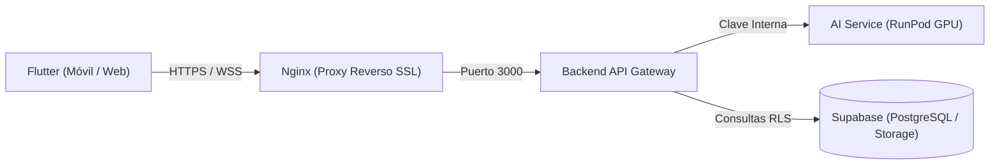

# Biomark AI — Frontend

Módulo de cliente multiplataforma del proyecto Biomark AI. La aplicación está construida en **Flutter** y orientada al despliegue simultáneo en dispositivos móviles (Android / iOS) y navegadores web de escritorio.

---

## 1. Conexión con el Ecosistema

La aplicación cliente se comunica de manera exclusiva con el **Backend API Gateway** a través de HTTPS. Nunca interactúa de forma directa con el servicio de inferencia de IA en RunPod ni con credenciales privilegiadas (`service_role` de Supabase).



---

## 2. Parámetros de Configuración por Entorno

Al compilar o ejecutar el cliente, se definen los parámetros de conexión mediante banderas `--dart-define`:

| Variable | Descripción | Ejemplo de Valor |
| :--- | :--- | :--- |
| `BIOMARK_API_URL` | URL base del backend expuesto por Nginx | `https://api.biomark.org` o `http://localhost:3000` |
| `BIOMARK_ACCESS_TOKEN` | Token JWT para depuración manual (opcional) | `eyJhbGciOi...` |

### Ejemplo de Arranque

```bash
cd flutter

# Ejecución para navegador web
flutter run -d chrome --dart-define=BIOMARK_API_URL=http://localhost:3000

# Ejecución para dispositivo móvil
flutter run -d <ID_DISPOSITIVO> --dart-define=BIOMARK_API_URL=https://api.tu-dominio.com
```

---

## 3. Principios de Diseño y Arquitectura

1. **Arquitectura Feature-First:** Cada funcionalidad reside en su propia carpeta modular dentro de `lib/features/` conteniendo sus capas de dominio, datos y presentación.
2. **Diseño Responsive:** La interfaz adapta sus cuadrículas, formularios y tarjetas tanto para pantallas táctiles de 4 a 6 pulgadas como para monitores panorámicos de escritorio.
3. **Accesibilidad Universal (WCAG 2.1 AA):**
   * Compatibilidad transparente con lectores de pantalla mediante etiquetas `Semantics`.
   * Modo opcional de Alto Contraste para debilidad visual en los ajustes de apariencia.
   * Botón de cierre y persistencia para la sugerencia del asistente de voz.
   * Áreas táctiles con un tamaño mínimo de interacción de 48 dp.
4. **Resistencia a Fallos de Red:** Las recomendaciones sanitarias y las lecturas de signos vitales cuentan con persistencia local en caché para puestos de salud con conectividad intermitente.

---

## 4. Pruebas y Análisis

Antes de realizar confirmaciones de código, se debe verificar la integridad del proyecto:

```bash
cd flutter
flutter test
flutter analyze
```
