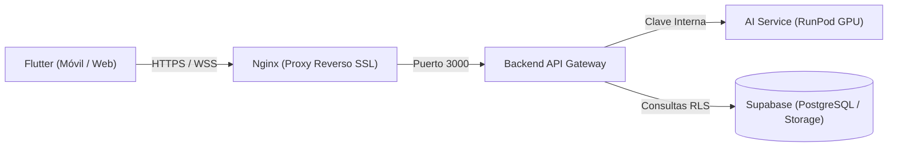

# Biomark AI — Frontend

Módulo de cliente multiplataforma del proyecto Biomark AI. La aplicación está construida en **Flutter** y orientada al despliegue simultáneo en dispositivos móviles (Android / iOS) y navegadores web de escritorio.

---

## 1. Conexión con el Ecosistema

La aplicación cliente se comunica de manera exclusiva con el **Backend API Gateway** a través de HTTPS. Nunca interactúa de forma directa con el servicio de inferencia de IA en RunPod ni con credenciales privilegiadas (`service_role` de Supabase).


```mermaid
flowchart LR
  App["Flutter (Móvil / Web)"] -->|HTTPS / WSS| Proxy["Nginx (Proxy Reverso SSL)"]
  Proxy -->|Puerto 3000| Backend["Backend API Gateway"]
  Backend -->|Clave Interna| AIService["AI Service (RunPod GPU)"]
  Backend -->|Consultas RLS| Supabase[("Supabase (PostgreSQL / Storage)")]
```

---

## 2. Parámetros de Configuración por Entorno

Al compilar o ejecutar el cliente, se definen los parámetros de conexión mediante banderas `--dart-define`:

| Variable | Descripción | Ejemplo de Valor |
| :--- | :--- | :--- |
| `BIOMARK_API_URL` | URL base del backend expuesto por Nginx | `https://api.biomark.org` o `http://localhost:3000` |
| `BIOMARK_ACCESS_TOKEN` | Token JWT para depuración manual (opcional) | `eyJhbGciOi...` |

### Ejemplo de Arranque

```bash
cd flutter

# Ejecución para navegador web
flutter run -d chrome --dart-define=BIOMARK_API_URL=http://localhost:3000

# Ejecución para dispositivo móvil
flutter run -d <ID_DISPOSITIVO> --dart-define=BIOMARK_API_URL=https://api.tu-dominio.com
```

---

## 3. Principios de Diseño y Arquitectura

1. **Arquitectura Feature-First:** Cada funcionalidad reside en su propia carpeta modular dentro de `lib/features/` conteniendo sus capas de dominio, datos y presentación.
2. **Gobernanza Sanitaria y Supervisión en Cascada:**
   * Activación institucional mediante código único en el registro (`RegisterScreen`) para vincular personal médico o promotores a su centro de salud.
   * Gestión y supervisión de promotores comunitarios (`MyPromotersScreen`) exclusiva para personal de salud (`TRABAJADOR_SALUD`, `ADMIN`).
   * Adaptación de navegación en `app_shell.dart` según el rol operativo del usuario.
3. **Triaje Comunitario CCM y Claridad Institucional:**
   * Reportes comunitarios con categorización de brotes, criaderos y opción descriptiva para "Otro".
   * Motor de triaje clínico CCM con detección de signos de peligro e insignias visuales (`ROJO` Urgente, `AMARILLO` Alerta, `VERDE` Rutinario).
   * Notificación clara de recepción por parte del personal de salud del MINSA / centro de salud local.
4. **Cálculo Dinámico de Edad:** Entrada basada en fecha de nacimiento (`fecha_nacimiento`) que calcula la edad en tiempo real sin requerir edición manual cada año.
5. **Diseño Responsive:** La interfaz adapta sus cuadrículas, formularios y tarjetas tanto para pantallas táctiles de 4 a 6 pulgadas como para monitores panorámicos de escritorio.
6. **Accesibilidad Universal (WCAG 2.1 AA / AAA):**
   * Compatibilidad transparente con lectores de pantalla mediante etiquetas `Semantics`.
   * Superficies translúcidas con Glassmorphism (`BiomarkGlassSurface`) y modo opcional de Alto Contraste con contraste > 7:1.
   * Sugerencia contextual de modo por voz con persistencia de cierre.
   * Áreas táctiles con un tamaño mínimo de interacción de 48 dp y auditoría antisolapamiento sin errores `RenderFlex`.
7. **Resistencia a Fallos de Red:** Base de conocimiento clínico offline (`MinsaOfflineKnowledge`) y motor autónomo de chat (`OfflineChatEngine`) para puestos de salud con conectividad intermitente.

---

## 4. Pruebas y Análisis

Antes de realizar confirmaciones de código, se debe verificar la integridad del proyecto:

```bash
cd flutter
# Ejecución de 16 pruebas unitarias y de widgets
flutter test

# Verificación estática (0 advertencias)
flutter analyze
```

Para más detalles sobre la arquitectura de confianza y triaje clínico, consulte [docs/ROLES_CONFANZA_Y_TRIAJE_CCM.md](../docs/ROLES_CONFANZA_Y_TRIAJE_CCM.md).
