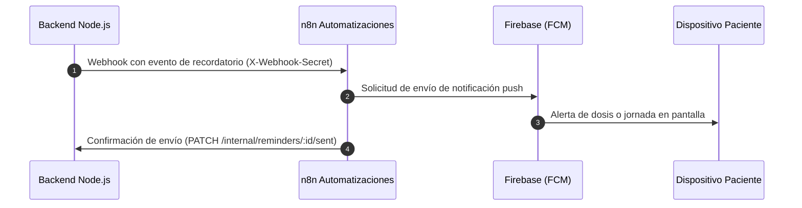

# Biomark AI — Automatización de Tareas (n8n)

Motor de automatización y orquestación de flujos de trabajo de salud preventiva autohospedado mediante Docker dentro de la red privada del sistema.

---

## 1. Función dentro del Ecosistema

n8n se encarga de la ejecución asíncrona de eventos preventivos y la entrega de alertas programadas:

1. **Recepción de Eventos:** Escucha los eventos emitidos por el backend cuando un paciente programa una toma de medicamento o una cita de vacunación.
2. **Despacho de Alertas Push:** Conexión con **Firebase Cloud Messaging (FCM)** para enviar la notificación directamente al dispositivo móvil del paciente en el horario programado.
3. **Confirmación de Entrega:** Llama al endpoint interno protegido del backend (`PATCH /internal/reminders/:id/sent`) para registrar la confirmación del aviso en el historial médico.



---

## 2. Configuración y Variables de Entorno

Las variables de conexión de n8n se definen en el archivo `deploy/.env`:

```env
N8N_HOST=localhost
N8N_PROTOCOL=http
WEBHOOK_URL=http://localhost:5678/
N8N_EDITOR_BASE_URL=http://localhost:5678/
N8N_SECURE_COOKIE=false
N8N_ENCRYPTION_KEY=tu_clave_de_encriptacion_permanente
```

> **Aviso de persistencia:** La variable `N8N_ENCRYPTION_KEY` nunca debe modificarse después de haber configurado credenciales en el panel de n8n, ya que de ella depende el descifrado de las conexiones y cuentas almacenadas.

---

## 3. Puesta en Marcha

Para iniciar el contenedor de n8n en el servidor:

```bash
docker compose --env-file deploy/.env up -d n8n
```

* **Acceso local:** `http://localhost:5678`
* **Acceso en producción:** A través de la ruta protegida configurada en Nginx (ej. `https://tu-dominio.com/n8n/`).

---

## 4. Importación del Flujo de Notificaciones

El repositorio incluye un flujo base listo para importar en `n8n/workflows/biomark-reminder-flow.json`:

1. Iniciar sesión en el panel web de n8n.
2. Seleccionar la opción **Import from File** y cargar el archivo `biomark-reminder-flow.json`.
3. Configurar la credencial de cuenta de servicio de Firebase (permiso `https://www.googleapis.com/auth/firebase.messaging`).
4. Asignar la variable de entorno interna `BIOMARK_WEBHOOK_SECRET` con el mismo valor configurado en el backend como `N8N_WEBHOOK_SECRET`.
5. Activar el flujo (*Active*).

---

## 5. Mantenimiento y Registros

Comandos habituales para la administración del contenedor:

```bash
# Ver registros en tiempo real
docker compose --env-file deploy/.env logs -f n8n

# Reiniciar el servicio tras cambios de configuración
docker compose --env-file deploy/.env restart n8n
```
